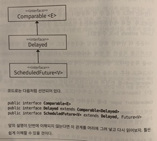

## 한정적 와일드카드를 사용해 API 유연성을 높이라

제네릭 타입은 불공변이다 [item28] 즉, 서로다른 타입 Type1, Type2가 있다면 `List<Type1>` 과 `List<Type2>`는 서로간 상위 타입도 하위 타입도 아니다.

그렇다면 `List<Object>`는 `List<String>`의 상위 타입이 아니라고도 볼 수 있다. 그렇다면 객체지향 5원칙 중 "L"에 해당하는 리스코프 원칙에 벗어나게 되는데 어떻게 할 수 있을까?

아래 예시를 보면서 살펴보자

```java
public class Stack<E> {
    public Stack();
    public void push(E e);
    public E pop();
    public boolean isEmpty();
}
```

여기서 일련의 원소를 스택에 놓는 메서드를 추가해야한다고 보자

```java
public void pushAll(Iterable<E> src) {
    for(E e : src) {
        push(e);
    }
}
```

이 메서드는 컴파일은 잘 되지만 완벽하지 못하다. Iterable src의 원소 타입이 스택의 원소 타입과 일치하면 잘 동작한다.하지만 `Stack<Number>`로 선언한 후 pushAll(intVal)을 호출하면 어떻게 될까? 여기서 intVal은 Integer 타입이다.

여기서 Integer는 Number의 하위타입이다. 그러므로 잘 동작해야 맞을 것인데! 컴파일 오류가 발생한다.

```java
Stack<Number> numberStack = new Stack<>();
Iterable<Integer> integers = ...;
numberStack.addAll(integers);

=> incompatible types: Iterable<Integer> cannot be converted to Iterable<Number>

```

이런 상황에 대처할 수 있는 **한정적 와일드카드 타입**이라는 특별한 매개변수화 타입을 지원한다. pushAlldml 입력 매개변수 타입은 'E의 Iterable'이 아니라 'E의 하위타입의 Iterable'이어야 하며 와일드 카드 타입 `Iterable<? extends E>`가 정확하게 이런 뜻이다.

> 저자는 여기서 extends라는 키워드는 상황에 안어울린다고 적어두긴 했다. 하위타입이란 자기자신도 포함하지만 그렇다고 확장한 것은 아니기 때문이라고 한다. 공감은 하지만 자바언어에서는 상속이나 하위를 나타낼때, extends를 쓸텐데 어쩔 수 없는게 아닌가 싶긴하다.

이렇게 적용하면 정상적으로 pushAll이 동작하게 된다.

```java
public void pushAll(Iterable<? extends E> src) {
    for(E e : src) {
        push(e);
    }
}
```

이번엔 popAll 메서드를 볼 차례다.

Stack안의 모든 원소를 다른 Collections로 모두 옮겨 담는 역할이다.

```java
public void popAll(Collection<E> dst) {
    while(!isEmpty()) {
        dst.add(pop());
    }
}
```

이번에도 컬렉션의 원소 타입이 스택의 원소 타입ㅇ과 일치하면 문제없이 컴파일됙고 동작한다. 하지만 이번에도 완벽하진 못하다.
`Stack<Number>`의 원소를 Object용 컬렉션으로 올기려고 해보자.

```java
Stack<Number> numberStack = new Stack<>();
Collection<Object> objects = ...;
numberStack.popAll(objects);

=> 위에 pushAll했을 때와 비슷한 상황이 발생한다.
Collection<Object>는 Collection<Number>의 하위타입이 아니다.
```

이번에도 와일드 카드로 해결할 수 있다. 여기서는 popAll의 입력 매개변수의 타입이 'E의 Collection'이 아니라 'E의 상위 타입의 Colelction'이어야 한다.

```java
public void popAll(Collection<? super E> dst) {
    while(!isEmpty()) {
        dst.add(pop());
    }
}
```

### 유연성을 극대화하려면 원소의 생산자나 소비자용 입력 매개변수에 와일드카드 타입을 사용하라.

한편, 입력 매개변수가 생산자와 소비자 역할을 둘 다 한다면 와일드카드 타입을 써도 좋을 게 없다. 타입을 확실히 지정해야함으로 와일드카드를 쓰지 말아야한다.

> _생산자와 소비자 구분_
> producer와 consumer에 대해선 스스로 다음과 같이 이해했다.
> 소비자 -> 내부필드에서 데이터를 사용해 소비자에게 전달할 때,
> 생산자 -> 내부필드로 데이터를 전달해 새롭게 또는 무언가를 만들 때,

#### PECS(팩스)

producer-extends, consumer-super

> 거창한건 아니고 공식처럼 외우면 좋을 것 같다고 한다.

```java
public static <E> Set<E> union(Set<E> s1, Set<E> s2)

-> PECS 변환하면

public static <E> Set<E> union(Set<? extends E> s1, Set<? extends E> s2);

Set<Integer> integers = Set.of(1,2,3);
Set<Double> doubles = Set.of(1.1,2.2,3.3);
Set<Number> numbers = union(integers, doubles);

// 재대로만 사용하면 클래스 사용자는 와일드 카드 타입이 쓰였는지 의식하지 못한다.
// 클래스 사용자가 와일드카드 타일을 신경써야한다면 그 API에는 문제가 있을 가능성이 높다.
```

앞의 코드는 자바 8부터 재대로 컴파일이 되는데 자바 7까지는 타입추론 능력이 강력하지 못해 문맥에 맞는 반환타입을 명시해야 했다.

`Set<Number> numbers = Union.<Number>union(integers, doubles);`

> 처음 안 부분! 자바8에선 타입추론능력이 강해졌다.

```java
public static <E extends Comparable<E>> E max(List<E> list);

-> PECS 적용

public static <E extends Comparable<? super E>> E max(List<? extends E> list)
-> PECS 2번 적용사례
```

타입 매개변수 E는 `Comparable<E>`를 확장한다고 정의했는데 이때, `Comparable<E>`는 E인스턴스를 소비한다.
그래서 매개변수화 타입 `Comparable<E>`를 한정적 와일드카드 타입인 `Comparable<? super E>`로 대체했다.

Comparable은 언제나 소비자이므로 `Comparable<E>`보다는 `Comparable<? super E>`가 낫다.
Comparator도 동일하다.

#### max도 이렇게 복잡한 메서드인데 복잡하게 만들만한 가치가 있나? 있다고하는데 한 번 알아보자.

일단 구현하기 전이었다고 치면 `List<ScheduledFuture<?>> scheduledFutures = ...;`는 동작하지 않는다.

왜냐하면 java.util.concurrent(동기 관련 API)에서 ScheduledFuture는 Comparable을 구현하지 않았다.

ScheduledFuture는 Delayed의 하위 인터페이스고 Delayed는 Comparable를 구현했다. 그렇기에 직접구현하지 않았다면 다른 타입을 확장한 걸 지원하려고 와일드 카드가 필요한거다.



#### 와일드카드와 관련해 논의해야 할 주제가 하나 더 있다.

타입 매개변수와 와일드카드에는 공통되는 부분이 있어서 메서드를 정의할 때 둘 중 어느것을 사용해도 괜찮을 때가 있다

아래를 보자

```java
public static <E> void swap(List<E> list, int i, int j);
public static void swap(List<?> list, int i, int j);

// 어떤 선언이 더 나을까?
// public API라면 간단한 2번째가 더 낫다.
```

##### [규칙1]. 메서드 선언에 타입 매개변수가 한 번만 나오면 와일드카드로 대체하라

```java
public static void swap(List<?> list, int i, int j) {
    list.set(i, list.set(j, list.get(i)));
}
```

컴파일 하면 오류 메세지가 나온다

왜? => 와일드카드(?)라면 null이외에는 어떤 값도 넣을 수 없기 때문이다.

다행히 형변환이나 리스트의 로 타입을 사용하지 않고도 해결할 방법이 있다! 와일드카드 타입의 실제 타입을 알려주는 메서드를 private 도우미 메서드로 따로 작성해 활용하는 방법이다.

```java
public static void swap(List<?> list, int i, int j) {
    swapHelper(list, i, j);
}
private static <E> void swapHelper(List<E> list, int i, int j) {
    list.set(i, list.set(j, list.get(i)));
}
```

swapHelper는 리스트가 `List<E>`임을 알고있다. 즉, 보낸 타입은 항상 E이고 E타입의 값이라면 이 리스트에 넣어도 안전하다는 걸 안다.

### 정리

복잡하더라도 와일드카드 타입을 적용하면 API가 훨씬 유연해진다. 그러니 널리 쓰일 라이브러리를 작성한다면 와일드카드 타입을 적절히 사용해줘야한다.

PECS도 이번에 잘 기억하고 있어보자. Comparable과 Comparator는 둘 다 소비자라는 걸 잊지 말자.

Producer(생산자) -> extends, Consumer(소비자) -> super
