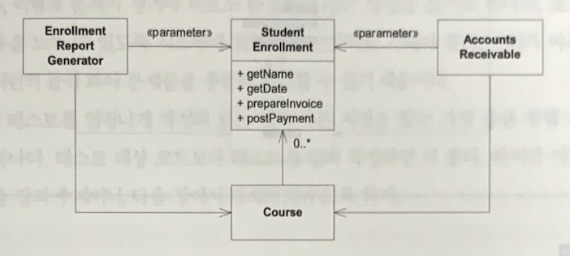
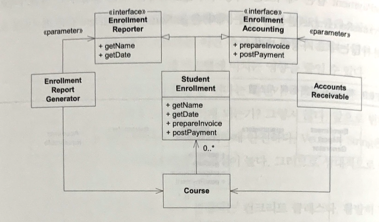

### 4. ISP(인터페이스 분리 원칙)

**클라이언트는 자신이 사용하지 않는 메서드에 의존관계를 맺으면 안된다.**

비대한 클래스(fat class)란 메서드를 몇십 몇백 개 가지는 클래스를 가리키는 말이다.

대게 시스템안에 클래스를 두고 싶어하지 않지만, 피할 수 없는 경우도 가끔 있는 법이다.

비대한 클래스가 거대하고 보기 흉하다는 사실 말고도, 한 사용자가 이 비대한 클래스의 메서드를 다 사용하는 일이 매우 적다는 것도 문제다.

즉, 메서드를 몇십개 선언한 클래스에서 사용자는 단지 두세 개만 호출할지도 모른다. 불행하게도 이 사용자들은 '호출하지도 않는' 메서드에 생긴 변화에서도 영향을 받는다.

#### Example



EnrollmentReportGenerator가 prepareInvoice나 postPayment 같은 메서드를 사용하지 않는다는 건 명백하다.

AccountRecivable 역시 getName, getDate같은 메서드를 호출하지 않느다고 가정하자.

이제 요구사항이 변해서 PostPayment 메서드에 새 인자를 추가할 수 밖에 없다. StudentEnrollment의 선언을 바꾸는 이 변화 때문에 EntrollmentReportGenerator가 재 컴파일하고 배포할지도 모른다. => 재컴파일을 피하지 못하는 IDE도 있기 때문

다음의 규칙을 지키면 불행한 의존관계를 피할 수 있다.

사용자에게 딱 필요한 메서드만 있는 인터페이스를 제공해 필요하지 않는 메서드에서 사용자를 보호하라. 다음의 그림이 이 규칙을 적용했다.



StudentEnrollment 객체를 사용하는 사용자마다 자신이 관심있는 메서드만 있는 인터페이스를 제공받는다. 이렇게 하면 사용자가 관심없는 메서드에서 생긴 변화에 사용자를 보호할 수 있다. 그리고 사용자가 자신이 사용하는 객체를 너무 많이 알게되는 일도 막을 수 있다.

#### 코드로 변환

```java
public interface EnrollmentReporter {
    String getName();
    LocalDateTime getDate();
}

public interface EnrollmentAccounting {
    void prepareInvoice();
    void postPayment();
}

public class StudentEnrollment implements EnrollmentReporter, EnrollmentAccounting {
    private String name;
    private LocalDateTime date;

    @Override
    String getName() {
        return name;
    }
    @Override
    String getDate() {
        return date;
    }

    @Override
    void prepareInvoice() {
        // 송장 준비
    }
    @Override
    void postPayment() {
        // 지불명세서 전송
    }
}

public class Course {
    private String name;
    private List<StudentEnrollment> studentEnrollments;

    private void join(String name, LocalDateTime date) {
        StudentEnrollment enroll = new StringEnrollment(name, date);
        studentEnrollments.add(enroll);
    }

}

public class EnrollmentGenerator {
    Course course;
   
    public generate(EnrollmentReporter reporter) {
        course.join(reporter.getName(), reporter.getDate());
    } 

}
public class AccountsReceivable {
    Courcse course;
   
    public AccountsReceivable(EnrollmentAccounting accounting) {
        this.accounting = accounting;
    }
}
```

### 정리

그림에 좀 더 필드가 정의되어 있다면 정확히 이해하고 구현을 실습해볼 수 있을텐데 좀 아쉽다.

다만, ISP를 통해서 가져가려고 하는 포인트는 주변에 영향을 받는(재컴파일 등) 클래스를 줄여 의존관계를 맺지 말라는것 같다. 