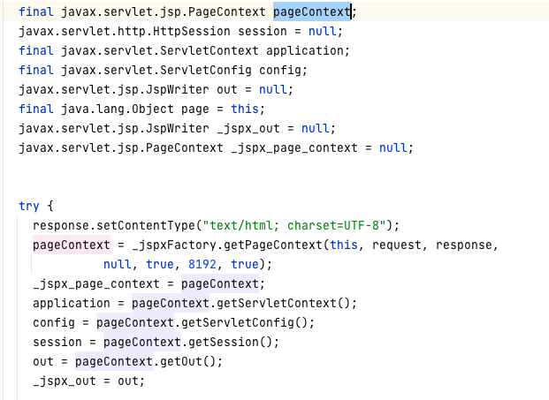
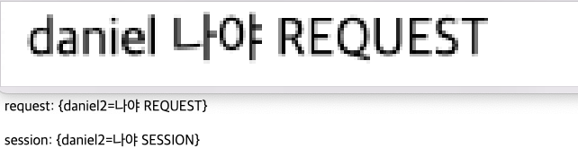
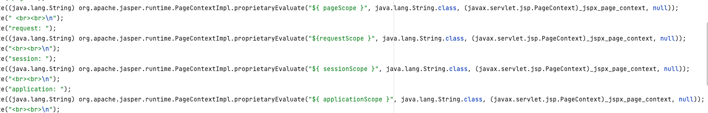

## EL(Expression Language)

-   표현을 위한 언어로 JSP 스크립트의 표현식을 대신해 속성값을 쉽게 출력하기위해 고안된 language다.
-   JSP 2.0 이상 도입
-   ${CODE}로 표현

> pageScope와 pageContext를 해깔리지 말자. 두개는 다르다. 아래서 설명한다.

### PageContext

타입 : java Bean
현재 페이지의 프로세싱을 담당한다.
대표적으로 사용할 수 있는 객체들은 pageContext를 통해 얻는다.

### 스코프

EL 태그에는 4개의 Scope가 존재한다.
타입 : Map

-   page
    -   page scope에 저장된 객체를 추출
    -   pageContext.setAttribute , JSTL의 c:set
-   request
    -   request scope에 저장된 객체를 추출
    -   HttpServletRequest
-   session
    -   session scope에 저장된 객체를 추출
    -   HttpSession
-   application
    -   application scope에 저장된 객체를 추출
    -   servletContext 부분

### 제공 객체

-   param : ServletRequest.getParameter(String)으로 정보 추출
-   cookie : HttpServletRequest.getCookies()를 통해 정보 추출
    -   ${cookie.id.value}

### 수치, 관계, 논리

-   empty
-   &&(and), ||(or), !(not)
-   3항 연산
-   관계형
    -   eq(==), ne(!=), lt(<), gt(>), le(<=), ge(>=)
-   산술
    -   +, -, \*, /, %

### EL 태그 사용중 변수에 -가 있다면?

. 접근도 가능하나 ["test-test"]도 가능

### EL태그 안 변수는 Null을 출력하지 않아요!

### 스코프를 JSP를 java코드로 변환된 부분에서 알아보자

PageContextImpl에서 proprietaryEvaluate를 통해서 scope 검색을 한다.

-   탐색순서 page -> request -> session -> application
    
    
