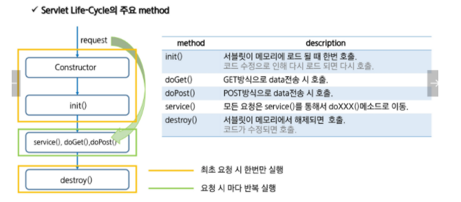

## Servlet Container

#### 서블릿 컨테이너란?

스스로 동작하지 않는 서블릿을 관리해주는 컨테이너로 클라이언트의 요청을 받고 응답할 수 있도록 웹서버와 소켓통신을 한다.

톰캣이 서블릿 컨테이너의 대표적이다.

#### 특징

-   동시요청을 위한 멀티 스레드 처리 지원
-   싱글톤으로 관리
-   서블릿 객체를 생성, 초기화, 호출, 종료하는 생명주기 관리
-   서블릿을 지원하는 WAS를 서블릿 컨테이너라고 부름.

#### 동작순서

-   클라이언트로부터 요청이 들어오면 컨테이너는 서블릿이 메모리에 있는지 확인 / 메모리에 없다면 Init 메서드를 호출
-   클라이언트 요청에 따라서 service 메소드를 통해 doGet, doPost로 분기. 이 때, HTTPServletRequest, HttpServletResponse에 의해 request, response 생성
-   컨테이너가 서블릿에 종료를 요청하면 destroy 메서드가 호출. 종료시 처리가 필요하면 destroy()에 오버라이딩해서 구현하기

#### Servlet 파라미터 처리

-   Get
    -   전송되는 데이터가 URL 뒤에 Query String으로 붙는다. 입력값이 적거나 데이터가 노출되도 문제가 되지 않을 경우 사용
    -   간단한 데이터를 빠르게 전달. URL에 직접 입력해서 전달도 가능
    -   데이터 전달에 제한이 있음 (2kb)로 제한
-   Post
    -   URL과 별도로 Http Header 뒤 body에 입력스트림 데이터로 전달
    -   데이터 제한 없음. 최소한의 보안효과를 얻을 수 있음.
    -   Get과 비교해 전달되는 데이터양이 같을 경우 느리다.
