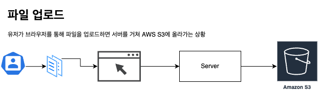
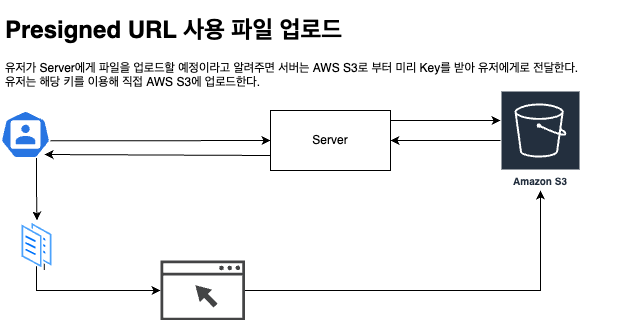

# S3에서 Presigned URL 사용하기

## Presigned URL 적용 이전까지 일반적인 파일 업로드 상황

서비스에서 이전까지 S3와 관련된 SDK를 통해 stream이나 메모리에 올려둔 파일을 업로드 했다.

이 경우에는 다음과 같은 단점이 존재하게 된다.

1. 서버에서 파일업로드 외에도 다양한 API 작업을 수행할텐데 파일업로드에 리소스(메모리, CPU)를 사용하게 된다.
2. Network Traffic 비용이 서버로 이동할 때, AWS로 전달할 때 2중으로 쓰인다. (AWS 등의 정책에 따라 무료일 수 있다.)

## Presigned URL은 어떤 일을 하나?

1. 미리 서버에서 파일이 업로드 될 것을 예상하고 params를 가지고 있는 URL을 하나 생성한다.
2. URL을 Client에게로 전달해 유저가 직접 AWS로 파일 업로드 or 다운로드를 가능하도록 조치한다.

## 얻을 수 있는 장점

1. *서버의 리소스를 사용하지 않고 업로드가 가능하다.* (제일 큰 장점이 아닐까 싶다)
2. Lambda나 별도의 서비스를 활용해 추가처리를 할 수 있다. (크게 와닿진 않음)
