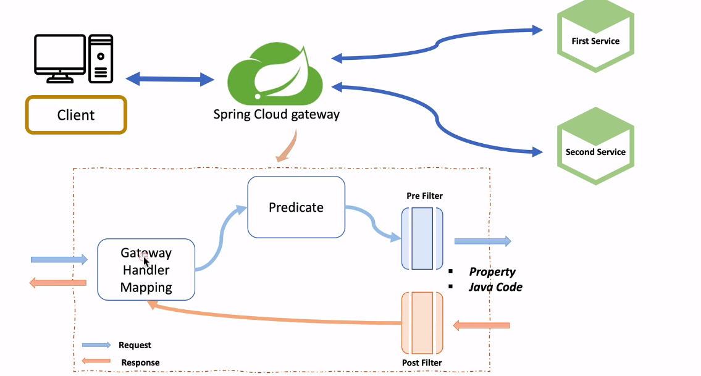

### API Gateway

#### 1. Spring Cloud에서 MSA 간 통신

1) RestTemplate
2) Feign Client

    ```java
        @FeignClient("stores")
        public interface StoreClient {
            @RequestMapping(emthod = RequestMethod.GET, value="/stores")
            List<Store> getStores();
        }
    ```

3) Ribbon: client side Load Balancer -> 비동기 처리가 잘 안되는 방식
    - 서비스 이름으로 호출
    - health check
    - 차후 버전에서 사용할지 말지 결정중(Springboot 2.4 에서 maintenance 상태)

#### 2, Netflix Zuul

- 구성
    - First Service
    - Second Service
    - Netflix Zuul (API GATEWAY 역할, Springboot 2.4에서 maintenance 상태)


#### 실습 1. Zuul을 활용한 service2개의 proxy 역할 수행

first_service, second_service, zuul_service 참고할 것.


[코드 이동](./Zuul%EC%9D%84%20%ED%99%9C%EC%9A%A9%ED%95%9C%20API%20Gateway/);

#### 3. Spring Gateway Filter


yml 파일로 저장된 방법을 config를 통해 적용이 가능하며, request, response 헤더를 넣을 수 있다.

```java
@Configuration
public class FilterConfig {
    @Bean
    public RouteLocator gatewayRoutes(RouteLocatorBuilder builder) {
        return builder.routes()
                .route(r -> r.path("/first-service/**")
                        .filters(f -> f.addRequestHeader("first-request", "first-request-header").addResponseHeader("first-response", "first-response-header")).uri("http://localhost:8081/"))
                .route(r -> r.path("/second-service/**")
                        .filters(f -> f.addRequestHeader("second-request", "second-request-header").addResponseHeader("second-response", "second-response-header")).uri("http://localhost:8082/"))
                .build();
    }
}

```

#### 실습 2. Gateway Filter 적용

[코드 이동](./Spring%20Cloud%20Gateway%20Filter/);

#### 실습 3. Gateway LoadBalancer

[코드 이동](./Spring%20Cloud%20Gateway%20-%20LoadBalancer/)