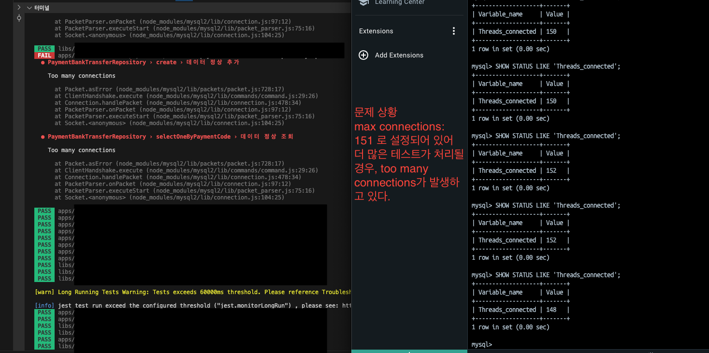

# Too Many Connection

## 왜 발생했는가?

Mysql connection을 계속 생성해서 MYSQL에 설정된 DEFAULT Connection(151) 수를 넘어서 Too Many Connections가 발생

결론: Jest에서 전체 테스트 시, MySQL 커넥션을 지속적으로 만들어내어 발생하게 되었다.

> MSA 환경에서는 많은 Connection이 발생할 수 있어 DB에서는 Connection 수를 특정 범위만큼 증가시켜둔 뒤 Connection 수를 관리하고 있다.

## 어떻게 해결할까?

1. MySQL의 Default Connection을 늘린다. [1], [2] 중 원하는 걸로 선택하기
    - connection 수 확인하기 `SHOW STATUS LIKE Threads_connected;`
    - /etc/my.cnf 수정하기 [1]
        - `max_connections = {원하는 숫자}`
    - sh 명령어 입력하기
        - `sudo service mysql restart` 
    - 변수 선언 [2]
        - `set global max_connections = {원하는 숫자}`
        - 단, 서버를 재시작하면 변경이 초기화되니 조심할 것. 재시작 없이 늘리고 싶을 때 유용

2. Jest에서 setup을 통해 global database를 공유해서 사용한다.

## 참고

1. https://ubiq.co/database-blog/how-to-increase-max-connections-in-mysql/
2. https://github.com/Daniel-Yonkov/jest-mysql