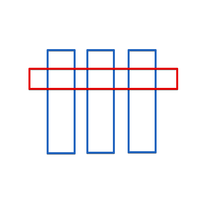
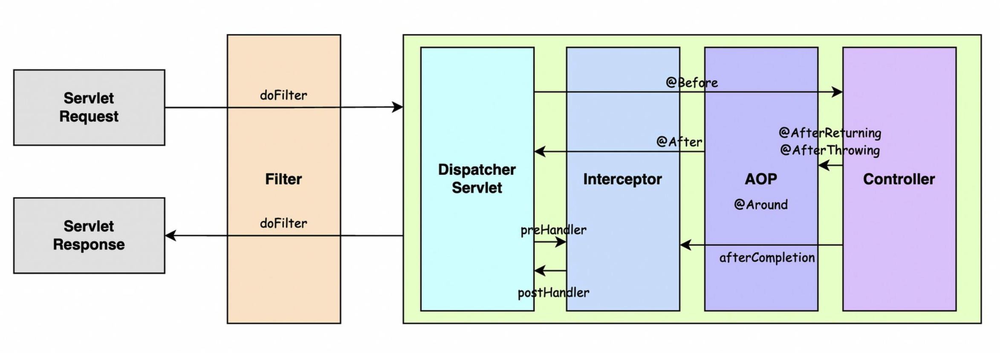

## Spring AOP

스프링 AOP는 Aspect Oriented Programming의 약자다. 관점 지향 프로그래밍이라고 해석이 된다.

무슨 말인지 잘 모를텐데 내 사연이 여기에 알맞을 것 같다.

### 1. 사연

인턴시절 내 선임이셨던 00님은 express 서버에서 컨트롤러, 서비스, 레포지터리마다 리턴할 데이터를 출력하는 로깅 패턴을 구현하신 적이 있었다.

그 패턴에 맞춰 구현을 하다보니 항상 코드에는 기능을 하는 로직과 로깅을 하는 로직 2가지 Context가 섞이는 경우가 발생했다.(에러는 아니지만)

의문이 있었다. 과연 로깅을 이렇게 빡세게 하면 서비스 코드에서 길어지는 이 현상을 유지해야 할 지..

함수를 Wrapping해서 코드와 로깅을 분리해 둘까? 고민을 한 시절이 있다.

### 2. Spring AOP

이런 상황에 Spring에서는 AOP를 활용하면 서비스 코드에 로깅 코드가 섞일일 없이 구분을 지을 수 있다. Awesome!



세로(파란색)가 구현하는 함수라면 가로(빨간색) AOP로 공통된 관심사항을 구분지을 수 있다.

#### Advice 용어

1. JoinPoint: 모듈이 삽입되어 동작하게 되는 특정 위치
2. PointCut: 다양한 JoinPoint 중에 어떤 것을 사용할 지 선택
3. Advice: JoinPoint에 삽입되어 동작할 수 있는 코드
4. Weaving: Advice를 핵심 로직 코드에 적용하는 것
5. Aspect: Advice + PointCut

#### AOP advice 종류

1. before: 메서드 호출 전 동작
2. after-returning: 예외없이 호출된 메서드의 동작이 완료되면 동작
3. after-throwing: 호출된 메서드 동작 중 예외가 발생했을 때 동작
4. after: 예외발생여부와 관계없이 호출된 메서드의 동작이 완료되면 동작
5. around: 메서드 호출 전과 후에 동작



### 3. Weaving (위빙)

글을 읽어보다가 나온 Weaving이라는 개념은 알고 있으면 좋을 것 같다.

공통코드를 핵심코드에 삽입하는 것을 위빙이라고 한다.

3가지 방법이 있는데

1. 컴파일 시 위빙
    - 별도의 컴파일러를 통해 핵심모듈 사이에 관점 형태로 만들어진 공통 관심코드가 삽입된다.
    - ex) AspectJ
2. 클래스로딩 시 위빙
    - 별도의 agent를 사용해 JVM이 클래스를 로딩할 때, 해당 클래스의 바이너리 정보를 변경합니다.
3. 런타임 시 위빙
    - 99%는 런타임 시 위빙으로 진행
    - 소스코드나 바이너리 변경 없이 프록시를 활용해 AOP를 지원.
    - 프록시를 통해 핵심 코드를 구현한 객체에 접근해 AOP를 지원한다.
    - ex) Spring AOP

### 4. maven repo 추가

```xml
    <properties>
        <org.aspectj-version>1.6.10</org.aspectj-version>
    </properties>
    <!-- AspectJ -->
    <dependency>
        <groupId>org.aspectj</groupId>
        <artifactId>aspectjrt</artifactId>
        <version>${org.aspectj-version}</version>
    </dependency>
    <!-- add -->
    <dependency>
        <groupId>org.aspectj</groupId>
        <artifactId>aspectjweaver</artifactId>
        <version>${org.aspectj-version}</version>
    </dependency>
```

### 5. 애너테이션을 활용한 AOP 구현

1. AOP 관련 autoproxy를 XML에 설정하기

    ```xml
        <!-- annotation : aop config -->
        <aop:aspectj-autoproxy></aop:aspectj-autoproxy>
        <!-- 컴포넌트를 스캔할 수 있도록 범위 지정 -->
        <context:component-scan base-package=""></context:component-scan>
    ```

2. Aspect 관련 클래스 생성

    ```java
    // execution문 작성법
    // 1. "[리턴 타입] [패키지].[클래스명].[함수명]([매개변수 명])"
    // 리턴타입: * <= 전부 다
    // 클래스명과 함수명: 특정 suffix, preffix 설정이 가능하다. ex) *DeliveryService, get*
    // 매개변수명: .. <= 어느타입이든 상관없음.
    @Component
    @Aspect
    public class DeliveryAspect {
        private static final Logger logger = LoggerFactory.getLogger(DeliveryAspect.class);

        @Before(value = "execution(* site.djunnni.aop.model.service.*DeliveryService.delivery*(..))")
        public void release(JoinPoint joinPoint) {
            logger.debug("@before call class name {}", joinPoint.getTarget().getClass().getName());
            logger.debug("@before call method name {}", joinPoint.getSignature().getName());

            Object[] args = joinPoint.getArgs();
            logger.debug("call args length: {}", args.length);

            String str = null;
            if(joinPoint.getTarget() instanceof FloorDeliveryService) {
                if(args.length > 0) {
                    str = "[공통로직] " + args[0] + "송이 출고 요청";
                } else {
                    str = "[공통로직] 5송이 출고 요청";
                }
            } else if (joinPoint.getTarget() instanceof BookDeliveryService) {
                if(args.length > 0) {
                    str = "[공통로직] " + args[0] + "권 출고 요청";
                } else {
                    str = "[공통로직] 5권 출고 요청";
                }
            }
            logger.debug("{}", str);
            logger.debug("{} {}", joinPoint.getTarget().getClass().getName(), joinPoint.getSignature().getName());
        }
    }
    ```

#### 애너테이션을 이용한 AOP 구현

[! aop-example](./archive/spring_aop_example.zip) 을 참고하세요.

### 참고

[AspectJ Weaver를 사용한 애노테이션 기반의 스프링 AOP 구현 방법](https://atoz-develop.tistory.com/entry/AspectJ-Weaver%EB%A5%BC-%EC%82%AC%EC%9A%A9%ED%95%9C-%EC%95%A0%EB%85%B8%ED%85%8C%EC%9D%B4%EC%85%98-%EA%B8%B0%EB%B0%98%EC%9D%98-%EC%8A%A4%ED%94%84%EB%A7%81-AOP-%EA%B5%AC%ED%98%84-%EB%B0%A9%EB%B2%95)
[[AspectJ Weaver] execution 지시자 설정 방법 정리](https://atoz-develop.tistory.com/entry/AspectJ-Weaver-execution-%EC%A7%80%EC%8B%9C%EC%9E%90-%EC%84%A4%EC%A0%95-%EB%B0%A9%EB%B2%95-%EC%A0%95%EB%A6%AC)
[[Spring] Spring 기초](https://programforlife.tistory.com/103?category=940901)
