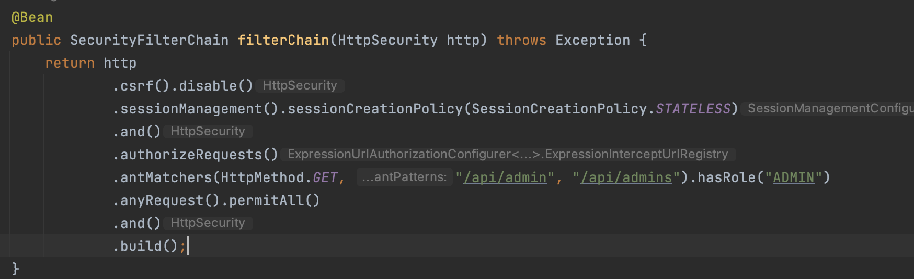

# URI 패턴에 대해 이해하기

### 스프링 시큐리티에서 URI 자원 맨 끝에 슬래시(/) 붙이는 걸 조심해야하는 이유

RESTful API 설계 규칙에서는 URI값에 슬래시(/) 구분자를 삽입하는 방법으로 계층을 구분한다. 또한 URI값은 유일한 식별자로 사용해야 되므로 반드시 끝에는 문자로 끝나야한다. 만약 슬래시(/)가 들어가면 부정확한 값으로 혼동을 줄 수 있다.

스프링 시큐리티로 URI 규칙을 미리 등록해둘 수 있는데 사용자 요청에 따라 등록해둔 접근제어규칙과 매칭해 허용 or 차단을 하면 된다.

두가지 특성에 의거 슬래시로 인해 스프링 시큐리티의 접근제어 규칙을 우회하는 틈이 발생한다.

### 대처하는 방법은?

#### 1. 화이트리스트 기반

| 허용하는 조건 이외에 모두 차단하는 접근제어 방식

#### 2. 블랙리스트 기반

| 차단하는 조건 이외에 모두 허용하는 방식

```java
// 잘못된 설정 예시
.antMatchers(HttpMethod.GET, "/api/admins").hasRole("ADMIN")

// 올바른 설정 예시
.antMatchers(HttpMethod.GET, "/api/admins/**").hasRole("ADMIN")
```



블랙리스트 기반 접근 제어방식에서 `/api/admins/` URI로 요청이 올 경우, 스프링 시큐리티 'antMathers' 함수에서 `/api/admins`와 문자열을 비교해 서로 일치하지 않는 것으로 판단하고 차단으로 넘어가야 정상이다.

하지만 REST 아키텍쳐 규칙상 URI 슬래시가 붙지 않아야 하므로 `/api/admins/`를 `/api/admins`로 인식해 접근을 허용해 버린다.

블랙리스트 기반으로 막기 위해선 아래와 같이 설정해야한다.


이 부분에서도 까먹을 소지가 있으므로 spring-security는 `mvcMathers`를 제공하고 있다.

| 넷마블 글을 참고하면 
| 스프링 시큐리티에서는 ‘antMatchers’ 함수가 가진 취약점을 보완하기 위해, 보안 기능을 추가한 ‘mvcMatchers’ 함수를 제공하고 있습니다. 
| ‘mvcMatchers’ 함수를 사용해 ‘/api/admin’을 설정하면 ‘/api/admin/’, ‘/api/admin.html’, ‘/api/admin.xyz’ 모두 매핑할 수 있습니다.

따라서 [스프링 시큐리티 가이드](https://docs.spring.io/spring-security/site/docs/5.1.5.RELEASE/reference/htmlsingle/)에서 화이트리스트 기반 접근제어 방식이 올라와있으며 접근할 URI만 명시하고 그 외의 모든 URI는 인증이나 검증이 필요하다.

화이트 리스트나 블랙 리스트 설정 관련 코드는 [여기](/%EC%BD%94%EB%93%9C%20%EC%97%B0%EC%8A%B5%EC%9E%A5/cve-2016-5007/) 에서 테스트코드와 시큐리티 설정파일을 참고하자.

### 참고

https://netmarble.engineering/spring-security-path-matching-inconsistency-cve-2016-5007/

https://devlog-wjdrbs96.tistory.com/434