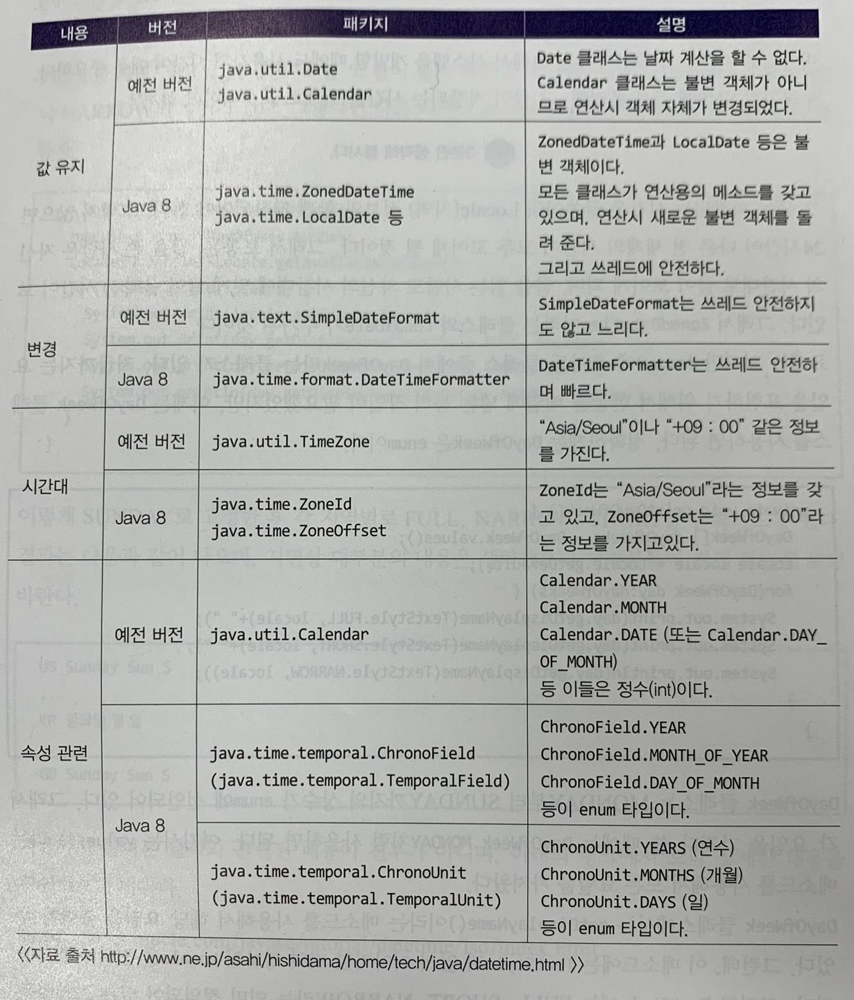

## java version 8

### Optional

`선택적인`의미로 Optional은 Funtional 언어인 Haskell, Scala에서 제공하는 기능을 따온 것이다.
`java.util` 패키지에 있다.

```java
public final Optional<T> extends Object {}
```

final로 선언했다고 내용변경이 불가능한건 아니다. 클래스이기에 추가적인 확장은 불가능하다. 즉, 자식클래스는 만들 수 없다.

* 값 넣기

```java
private void createOptionalObjects() {
    Optinal<String> emptyString = Optional.empty(); // 데이터가 없을 경우
    String common = null;
    Optinal<String> nullableString = Optional.isNullable(common); // null이 추가될 수 있는 상황이라면
    common = common;
    Optional<String> commonString = Optional.of(common); // 반드시 데이터가 들어갈 수 있는 상황이라면
} 
```
* 값 존재 유무
```java
System.out.println(Optional.of("present").isPresent()); // true
System.out.println(Optional.ofNullable(null).isPresent()); // false
```

* 값 가져오기
```java
private void getOptionalDate(Optional<String> data) throws Exception {
    String defaultValue = "default";
    String result1 = data.get(); // 데이터가 없을 경우 null 리턴
    String result2 = data.orElse(defaultValue); // 데이터가 없을 경우 기본값으로 들어감
    Supplier<String> stringSupplier = new Supplier<String> {
        @Override
        public String get() {
            return "daniel";
        }
    };
    String result3 = data.orElseGet(stringSupplier); // 데이터가 없을경우 기본값을 들어감
    Supplier<Exception> exceptionSupplier = new Supplier<Exception>() {
        @Override
        public String get() {
            return new Exception();
        }
    };
    Spring result4 = data.orElseThrow(exceptionSupplier); // 데이터가 없을 때, 예외를 발생시키고 싶은 경우
}
```

* 언제 Optional 클래스를 쓸까?

    * null을 좀더 쉽게 처리하려고 쓴다. 잘못하면 nullPointerException이 발생할 수 있는데 이경우 optional이 좋다. 단, optional 클래스에도 잘못 값을 넣으면 NoSuchElementException이 발생할 수 있다.

| orElse(), orElseGet()에서 주의할 점이 있다.
| orElse()의 경우 내부적으로 함수가 불릴 경우 함수가 자동 수행된다. 반면 orElseGet은 함수 수행이 null일 경우에만 불리게 된다.
| 왜 그러냐면 orElse의 선언문을 살펴봐야한다.
 ```java
       public T orElse(T other) {
            return value != null ? value : other; // 함수가 들어간다면 선언시 실행됨.
       }   
 ```

### Default Method

java8에서부터 정상적으로 컴파일이 된다.

```java
public interface DEfaultStaticInterface {
    static final String name="daniel";
    static final int since = 2013;
    String getName();
    int getSince();
    default String getEmail() {
        return "djunnni@gmail.com";
    }
}

```

default 메서드는 하위 호환성 때문에 도입됐다. 만약에 오픈소스가 유명해져서 전세계에서 많이 사용하는데 function을 하나 만들어 넣으면?
사용하고 있던 사람들이 전부 Exception이 발생할 것이다.(구현을 해주지 않았으니까)

이런 상황을 방지하고자 default 메서드가 도입됐다.

### 날짜 관련 class

이전에 쓴 Date, SimpleDateFormatter는 스레드에 안전하지 않다. 그렇기에 여러스레드에서 접근시, 예기치 못한 값들을 리턴할 수 있다.



### 병렬 배열 정렬

1. binarySearch()
2. parallelSort() // 단순 sort는 단일 쓰레드로 수행되지만 parallelSort의 경우 필요에 따라 여러 쓰레드로 실행하며 5,000건 이상부터 효과적임.

### StringJoiner

Java8부터 StringJoiner가 새롭게 추가됐다. 문자열을 처리할 때, 유리하다

```java
String[] stringArray = new String[] {"hello", "world", "dongjoon", "lee"};

StringJoiner joiner = new StringJoiner(",");
for(String s : stringArray) {
    joiner.add(s);
}
System.out.println(joiner); // => hello,world,dongjoon,lee

StringJoiner joiner2 = new StringJoiner(",","(",")");
for(String s : stringArray) {
    joiner2.add(s);
}
System.out.println(joiner2); // => (hello,world,dongjoon,lee)

List<String> stringList = Arrays.asList(stringArray);
String result = stringList.stream().collect(Collectors.joining(","));
System.out.println(result); // => hello,world,dongjoon,lee
```

### Lambda 표현식

1) 람다라고 읽기
2) 인터페이스에 메소드가 `하나`인 것들만 적용 가능
3) 람다 -> 익명 클래스로 익명 클래스 -> 람다로 전환이 가능

```java
interface Calculate {
    public int operation(int a, int b);
}
public class Calculator {
    public static void main(String[] args) {
        Calculate calculateAdd = new Calculate() {
            @Override
            public int operation(int a, int b) {
                return a + b;
            }
        };
        System.out.println(calculateAdd(1,2)); // 3

        Calculate calculateAdd2 = (a,b) -> a + b; // lambda 식
        System.out.println(calculateAdd2(1,2)); // 3
    }
}

```

일반적인 인터페이스지만, 이 인터페이스를 `Functional` 인터페이스라고 부를 수 있다.
기능적 인터페이스는 이와같이 하나의 구현함수만 가지고 있어야 하는데 매우 혼동될 가능성이 있다.

그러므로 `@FunctionalInterface` 어노테이션을 설정해서 하나의 메소드만 선언할 수 있게 하자.
| 2개 이상이 들어가면 컴파일러가 오류 메세지를 준다.

한줄 표현시 중괄호를 없애고 표현이 가능하다.

```java
Runnable run = new Runnable() {
    @Override
    public void run() {
        System.out.println("Hello lee");
    }
}
Runnable run2 = () -> System.out.println("Hello Lee");
```

### java.util.function package!

java.util에 functional 인터페이스는 java.util.function 패키지에 다음과 같이 있다.

* Predicate
    * test() 메서드가 있으며, 두 객체를 비교할 때, boolean을 리턴한다. 추가로 and(), negate(), or()라는 default 메소드가 구현되어 있으며 isEqual()이라는 메서드도 있음.
* Supplier
    * get() 메서드가 있으며, 리턴값은 generic으로 선언된 타입을 리턴함
* Consumer
    * accept()라는 매개변수를 갖는 메소드가 있으며, 리턴값은 없다. 출력할 때처럼 작업을 수행하고 결과를 받을 일이 없을 때 사용한다.
    * andThen()이라는 메서드가 있는데 순차적인 작업을 할 때, 유용하다.
* Function
    * apply라는 메서드가 있으며 변환을 할 필요가 있을 때, 이 인터페이스를 사용함 (감이 오지 않는다,,)
* UnaryOperator
    * apply메서드가 있으며 T -> T
* BinaryOperator
    * apply메서드가 있으며 (T,T) -> T

```java
Predicate<String> predicateLength5 = (a) -> a.length() > 5;
Predicate<String> predicateContains = (a) -> a.contains("GOD");
Predicate<String> predicateStart = (a) -> a.startsWith("GOD");
```

더 자세한 코드는 [여기](/%EC%BD%94%EB%93%9C%20%EC%97%B0%EC%8A%B5%EC%9E%A5/lambda/PredicateExample.java)에서 확인!

* predicateTest(): 데이터가 해당 조건에 맞는지를 확인
* predicateAnd(): 데이터가 두개의 조건에 모두 맞는지 확인
* predicateOr(): 데이터가 두개의 조건중 하나라도 맞는지 확인
* predicateNegate(): 데이터가 조건과 다른지 확인

### Stream

Stream은 줄기처럼 흐름이 있는 것 처럼 보인다.

그래서 연결형 데이터자료형과 관련이 있어보이는데, 대표적으로 Array와 Collection이 있다.

Collection에서는 Stream을 구현할 수 있지만 Array에는 구현함수가 없어 대체해서 가능하다.

```java
List<String> list = new ArrayList<>();
list.add("daniel");
list.add("muzi");

list.stream(); // 스트림객체

String[] arr = new String[]{ "daniel", "muzi" };
List<String> list2 = new ArrayList<>(Arrays.asList(arr));


```
스트림 생성 -> 중개연산 -> 종단연산

중개연산은 0개 이상만 존재하면 됨.

stream()보다 빠르게 연산하고 싶으면 parallelStream()을 활용하면 되나 병렬로 처리하는데 CPU 많이 소비 + 스레드로 처리할지 보장이 안됨. => 웹 프로그램에서는 stream으로 하자.


#### 메소드 참조

```java
forEach(System.out::println); 
```

더블 콜론을 사용하는 방법이 있는데 이를 Method Reference라고 부른다.

호출방법엔 4가지가 있다.

1) static method 참조
    ```java
        ContainingClass::staticMethodName
    ```
2) 특정객체의 인스턴스 메서드 참조
    ```java
        containingObject::instanceMethodName
    ```
3) 특정유형의 임의의 객체에 대한 인스턴스 메서드 참조
    ```java
        ContainingType::methodName
    ```
4) 생성자 참조
    ```java
        ClassName::new
    ```

