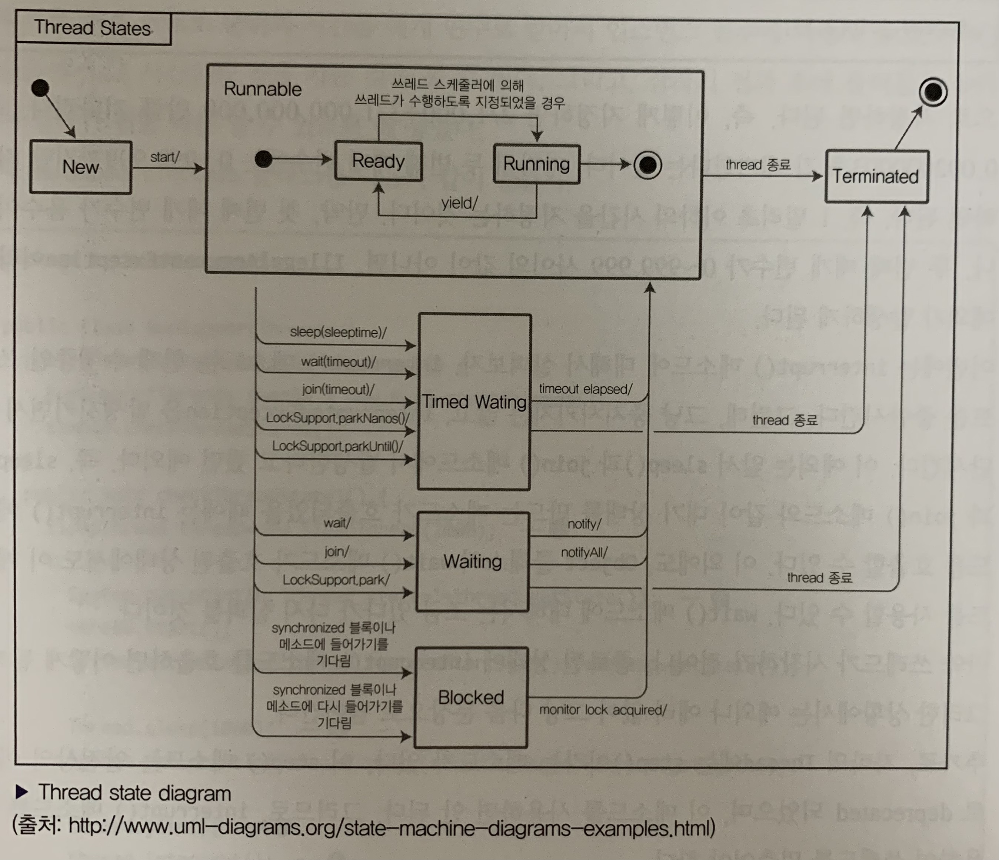

## 스레드

### 들어가기 전

자바에서 스레드가 어떻게 만들어지는지 알아보자

### 스레드를 만드는 방법

1) Runnable을 이용하는 방법
    ```java
        public class MyRunnable implements Runnable {
            
            @Override
            public void run() {
                // 실행할 명령어를 기입합니다.
            }

        }

        Runnable runnable = new MyRunnable();
        new Thread(runnable).start(); // start 명령어로 실행한다.
    ```
2) Thread를 이용하는 방법
    ```java
        public class MyThread extends Thread {
            
            @Override
            public void run() {
                // 실행할 명령어를 기입합니다.
            }

        }

        Thread thread = new MyThread();
        thread.start(); // start 명령어로 실행한다.
    ```

### Runnable외에도 Thread 2가지로 생성할 수 있는 이유는?

Thread도 Runnable을 implements(구현)해서 만들어져 있다.

또한 Thread는 클래스로 구성되어 있어 다른 클래스로부터 상속을 받게 된다면 구현을 직접해야한다. 이 부분을 Runnable을 통해 가능하다.

### 데몬 스레드

데몬스레드는 일반 스레드와 달리 JVM이 스레드가 끝날 때까지 기다리지 않고 종료할 수 있다.

데몬 스레드를 선언하는 방법은 `[Thread구현체].setDaemon(true)`로 실행(start())하기전에 지정해야만 한다.

데몬스레드가 필요한 순간은 스레드를 별도로 활용해 모니터링하다가, 스레드가 종료되면 관련 모니터링 스레드가 종료될 수 있게

주로 부가작업을 수행하는 스레드를 선언할 때는 데몬을 활용한다.

### synchronized(동기화)

자바 예약어 중 하나인 synchronized에 대해서 알아보자. 스레드에 안전하다라는 자료구조들을 들어본 적 있나?

그 말은 자료구조에서 여러 스레드가 동시에 접근했을 때, 그 상태를 끝까지 의도한대로 유지할 수 있느냐를 살펴야 한다.

예를 들어) StringBuffer는 스레드에 안전하고, StringBuilder는 스레드에 안전하지 못하다.

자바에서는 이런 꼬이는 문제를 처리하려고 할 때, synchronized를 활용해 처리한다.

1. 메소드 자체를 synchronized로 선언하기
2. 메소드 내의 특정 문장만 synchronized 블록으로 감싸는 방법

#### synchronized 블록으로 감싸는 걸 고려하는게 더 나은 이유

synchronized를 메소드 자체에 설정하면 성능이슈가 발생할 수 있다(느려지는!)

그 이유는 불필요한 변수와 메서드까지 동기화에 묶여 다른 프로세스에서 작업을 못하고 대기해야 하는 상황이 발생할 수 있기 때문이다.

그렇기에 사용되는 변수를 살피고 경우에 따라 블록처리를 해줘야한다.

[코드연습장의 Thread를 살펴보라](/%EC%BD%94%EB%93%9C%20%EC%97%B0%EC%8A%B5%EC%9E%A5/Thread/thread)

#### block을 이용한 synchronized 적용 [1]

```java
Object lock = new Object();
public void plus(int value) {
    synchronized(lock) {
        amount += value;
    }
}

public void minus(int value) {
    synchronized(lock) {
        amount -= value;
    }
}
```

#### block을 이용한 synchronized 적용 [2]

```java
Object interestLock = new Object();
Object amountLock = new Object();
public void plusInterest(int value) {
    synchronized(interestLock) {
        interest += value;
    }
}

public void minusAmount(int value) {
    synchronized(amountLock) {
        amount -= value;
    }
}
```

### 스레드 상태

1. NEW
    * 스레드 객체는 생성됐지만, 아직 시작 전
2. RUNNABLE
    * 쓰레드가 실행중인 상태
3. TIME_WAITING
    * 특정 시간만큼 쓰레드가 대기중인 상태
4. WAITING
    * 쓰레드가 대기중인 상태
5. TERMINATE
    * 쓰레드가 종료된 상태
6. BLOCKED
    * 쓰레드가 실행 중지 상태이며 모니터 락이 풀리기를 기다리는 상태


모든 상태는 `New -> [etc...!] -> TERMINATE` 로 끝난다.

### 스레드 라이프사이클



### interrupt는 언제 사용하나?

먼저 interrupt 함수를 실행하면 종료와 함께 `InterruptedException`이 함께 발생한다. 그러기에 sleep과 join을 사용할 때는 try-catch문을 사용해야한다.

thread의 `interrupt()`는 sleep, join과 같은 대기 상태를 만드는 메서드가 호출됐을 때 사용한다. 또한 Object.wait를 사용할 경우에도 쓸 수 있다.

### Object 클래스에 선언된 쓰레드와 관련있는 메서드

1) wait()
    * 다른 쓰레드가 Object 객체에 대한 notify(ALL) 메서드가 호출되기까지 현재 스레드가 대기하고 있도록 한다.
2) notify()
    * Object 객체의 모니터에 대기하고 있는 단일 스레드를 깨운다.
3) notifyAll()
    * Object 객체의 모니터에 대기하고 있는 모든 스레드를 깨운다.

### ThreadLocal을 이용한 독립적인 값을 보장하기

```java
public class ThreadLocalSample {
    private final static ThreadLocal<Integer> local = new ThreadLocal<Integer>();

    private static Random random;
    static {
        random = new Random();
    }

    public static Integer generateNumber() {
        int value = random.nextInt(45);
        local.set(value);
        return value;
    }

    public static Integer get() {
        return local.get();
    }

    public static void remove() { // remove를 별도로 수행해주는 이유는 웹 어플리케이션에서는 스레드 풀을 사용하는데 반환하고 재사용 시, 더미 값이 있으면 안되서 수동으로 지워줌
        local.remove();
    }

}
```

#### 사용하는 곳 코드
```java
public class LocalUserThread extends Thread {
    public void run() {
        int value = ThreadLocalSample.generateNumber();
        System.out.println("this.getNumber() => " + value);

        OtherLogic otherLogic = new OtherLogic();
        otherLogic.printNumber();
        threadLocalSample.remove();
    }
}

class OtherLogic {
    public void printNumber() {
        System.out.println("otherlogic.printNumber() => " + ThreadLocalSample.get());
    }
}
```