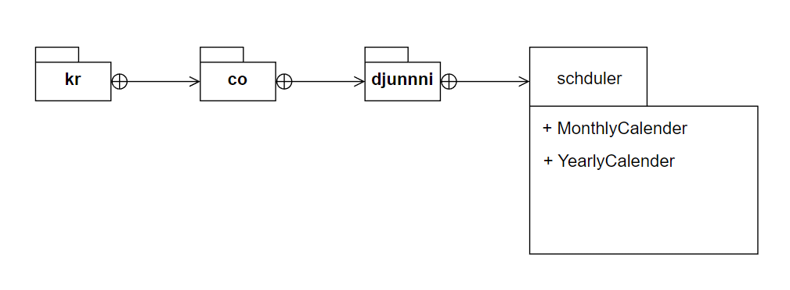

### 패키지

자바 패키지에서 중요한 건 두가지다.

하나는 자바의 package 키워드로 나타내는 소스코드 패키지, 다른 하나는 jar파일로 나타내는 바이너리 컴포넌트다.

#### 자바 패키지

자바 패키지에는 기본적으로 이름 공간이 있다. 패키지를 사용하면 다른 패키지에 있는 똑같은 이름의 클래스와 이름 충돌을 이르키지 않는다.

자바 컴파일 시스템은 소스코드의 패키지 구조를 본 떠 만든 디렉터리 구조 안에 생성한 이진 .class 파일들을 보관한다.

A.B.C => A/B/C.class로 들어있는 것. 자바 컴파일러는 .java 파일이 아니라 .class파일에서 외부선언을 읽어 오므로, 컴파일러와 런타임 시스템 둘 다 애플리케이션에 포함된 패키지들의 클래스경로를 올바르게 알아야 한다.

##### 의존관계

어떤 패키지의 내부코드가 다른 패키지에 속한 코드에 의존하는 경우도 있다.

코드의 import가 발생했다고 의존관계가 형성되는 것은 아니다. 정말로 코드 안에서 상속 or 구현 등 정말로 써야한다.

#### 바이너리 컴포넌트 - jar

패키지와 마찬가지로 컴포넌트도 의존 관계를 맺는다. 사실 컴포넌트 패키지가 하나 이상 들어있는 경우가 많기 때문에, 패키지들의 의존관계가 그대로 컴포넌트 사이의 의존 관계로 이어지는 경우가 많다. 하지만 모두 그런 것은 아니다.

여기서 표현한 Calendar(interface)의 방법은 올바르지 않을 수 있다. draw.io에서 제공하는 UML에 interface로 보이는게 이것뿐이었다.
그래도 interface Calendar을 구현해서 만드는 LunarCalendar의 의미를 내포한다.