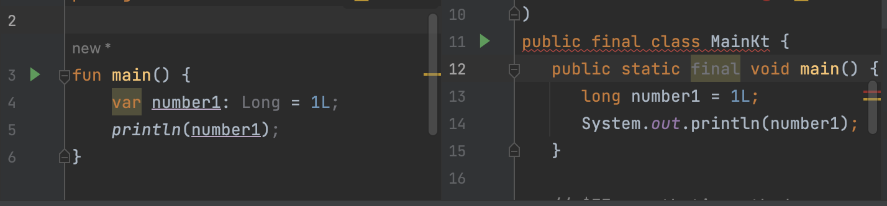

# 1. 코틀린에서 변수를 다루는 방법

## 1. 코틀린 변수 선언 키워드

코틀린에서는 변수를 선언할 때, `var` 키워드와 `val` 키워드가 존재한다. 타입을 의무적으로 작성하지 않아도 되지만 기록하고 싶다면 아래 예시처럼 `:`을 이용하면 됨.

|구분|var|val|
|--|--|--|
|수정가능 여부| 가능 | 불가능 |
|타입 지정| 가능 | 가능 |

```kotlin
(가능한 케이스)
var number1 = 1L;
val number2 = 1_000L;

(불가능한 경우)
val number2 = 1L;
number2 = 2L // Val cannot be reassigned

(가능한 경우)
// number2는 불변 키워드로 지정되었지만 첫 선언에서는 값을 초기화하지 않고 타입지정만으로 가능하다. (타입 지정하지 않으면 에러)
val number2: Long;
number2 = 4L;

(가능한 경우)
// val 컬렉션에는 element를 추가할 수 있다.
val list: MutableList<Long> = ArrayList<Long>();
list.add(1);
list.add(2);
list.add(3);

print(list)
```
> 타입스크립트를 사용했을 경우,
> 1. 타입 추론은 명시된 경우에만 기입되고 그 외엔 any 타입으로 무엇이 들어오든 허락하지만 코틀린은 컴파일하면서도 추론이 가능하다는 점이 신기합니다.
> 2. var는 let, var와 유사하며 val은 const와 유사합니다.

### 타입 지정시, ReferenceType을 사용했는데 성능에 괜찮을까?

Kotlin은 Reference 타입으로 변수의 타입을 지정하면 컴파일 과정에서 원시타입으로 자동 변환해준다. 그러므로 boxing / unboxing을 고려하지 않아도 된다.


> intellij에서 kotlin 바이트코드를 decomplie해서 보면 알 수 있다.

### nullable 선언은 어떻게 하지?

타입을 지정할 때, `?`를 추가하면 됩니다.
아예 다른 타입으로 간주된다. (2. 코틀린 null 다루는 법에서 알아보기)

```kotlin
var item: Long? = 123L;
item = null;
print(item);
// null
```

### 객체 인스턴스화

`new` 키워드를 입력하지 않고 클래스명으로 생성합니다.

```kotlin
val person: Person = Person("이동준");
```

