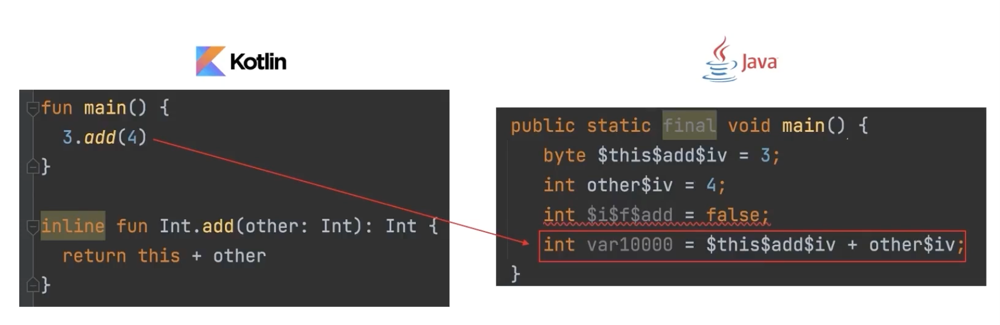

# 10. 코틀린에서 다양한 함수 다루는 방법

## 1. 확장함수

> 기존 자바코드 위에 자연스럽게 코틀린 코드를 추가할 순 없나? 🧐 <br>
> 어떤 클래스안에 메소드 처럼 호출할 수 있지만 함수는 밖에 만들수 있게!

```kotlin
// String.kt

fun main() {
    val str = "ABC"
    println(str.lastChar())
}

fun String.lastChar(): Char { // String 클래스를 확장하겠다. 
    return this[this.length - 1] // this로 클래스안의 값에 접근을 할 수 있다.
}
```

> 확장함수가 public이고 수신객체 클래스의 private 함수를 가져오면 캡슐화가 깨지는 거 아닌가? <br>
> 확장함수는 클래스에 있는 private, protected를 가져올 수 없음.

자바에서 확장함수를 kotlin에서 만드는데 같은게 2개가 생기면?

```java
public class Person {
    public int nextYearAge() {
        return this.age + 1;
    }
}
```

```kotlin
fun Person.nextYearAge() {
    print("확장함수")
    return this.age + 1;
}

fun main() {
    val person = Person();
    person.nextYearAge(); // 멤버함수를 우선적으로 호출함!
}
```

> 확장함수랑 같은 멤버함수를 나중에 생성하면 의도치 않는 문제가 발생할 수 있다.

[12](./img/12.example.png)
[13](./img/13.example-result.png)

> 해당변수의 현재 타입 -> 정적인타입에 의해 어떤함수가 불릴지 알 수 있다.

정적함수로 변경되기에 JAVA에서는 static 함수로 쓸 수 있다.

또한 확장 프로퍼티의 원리는 확장함수 + custom getter와 동일하다.

```kotlin
fun String.lastChar(): Char {
    return this[this.length - 1]
}
=========>
val String.lastChar: Char get() = this[this.length - 1]
```

> 확장함수 + custom getter와 연결될 수 있다.

## 2. infix 함수 (중위함수)

```kotlin
fun Int.add(other: Int): Int {
    return this + other
}

infix fun Int.add2(other: Int): Int {
    return this + other
}
// ==========>
3 add2 4
3.add2(4)
3.add(4)

```

> 멤버함수에도 붙일 수 있음

## 3. inline 함수

```kotlin
fun main() {
    3.add(4);
}

inline fun Int.add(other: Int): Int {
    return this + other
}
```



> 함수 파라미터로 전달할 때, 오버헤드를 줄일 수 있음.
> inline 함수의 사용은 성능 측정과 함께 신중히 사용해야 됨.

## 4. 지역함수

함수 안에 함수를 선언한다.

```kotlin
fun createPerson(firstName: String, lastName: String): Person {
    fun validateName(name: String, lastName: String) { // 내부함수 생성이 가능
        if(name.isEmpty()) 
            throw IllegalArgumentException("비어있다.");
    }

    validateName(firstName, "firstName");
    validateName(lastName, "lastName");

    return Person(firstName, lastName, 1);
}
```
