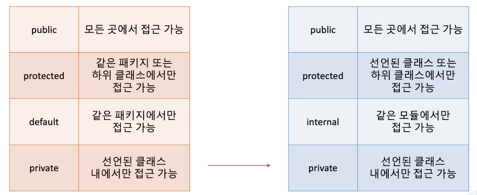

# 14. 코틀린에서 접근제어 다루는 방법

## 1. 가시성 제어



protected -> 같은 패키지는 불가능하고 선언된 클래스에서만 -> 패키지를 namespace 관리용도지 가시성 제어용은 아니다.
defaul -> 코틀린에서는 사라지고 internal이 생김

module -> 한번에 컴파일 되는 kotlin 코드

자바에서는 default가 접근지시어지만 kotlin은 public이다.

## 2. kotlin 파일에 접근제어 가능범위는?

public -> 어디서든 접근 가능
protected -> 파일 최상단에서는 사용 불가능
internal -> 같은 모듈에서만 가능
private -> 같은 파일에서만 가능


## 3. 클래스, 생성자, 프로퍼티에 설정하면?

생성자에 접근 지시어를 붙이려면 constructor를 반드시 붙여야 한다.
```kt
class Cat internal constructor(val name: String) {}
```

### 3.1 자바에서 유틸성 코드 만들때는?

```java
public abstract class StringUtils {
    private StringUtils() {}
    public boolean isDirectoryPath(String path) {
        return path.endsWith("/");
    }
}
```

abstract class + private constructor로 인스턴스화를 막았다.
> 코틀린도 가능함. 그러나 파일에 바로 유틸함수 만드는게 낫다.

```kt
// StringUtil.kt

fun isDirectoryPath(path: String): Boolean {
    return path.endsWith("/")
}
```

### 3.2 프로퍼티 가시성

1. val, var 앞에 접근지시어 설정
2. custom getter, setter에 다른 가시성을 부여할 수 있음.

```kt
    class Car(internal val name: String, private var owner: String, _price: Int) {
        var price: _price
            private set(v: Int) {
                field = v
            }
    }
```

## 4. 같이 쓸 때 주의할 점.

1. internal은 바이트 코드 상 public이다. -> 자바 코드에서는 kotlin 모듈의 internal을 가져올 수 있다.
2. kotlin의 protected와 java의 protected는 다르다. -> java는 같은 패키지의 kotlin protected 맴버에 접근 가능하다.

