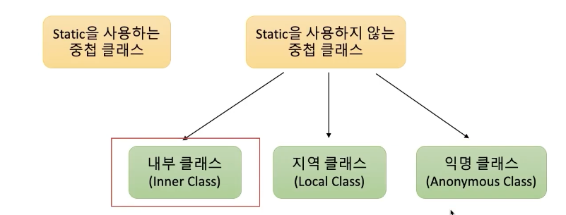
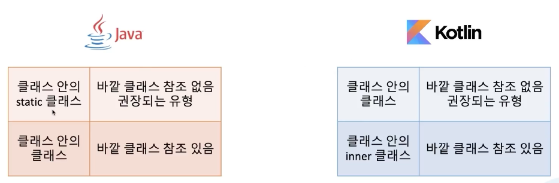

# 코틀린에서 중첩클래스 다루는 방법

## 1. 중첩 클래스 종류



- 클래스 안에 static을 붙이면 밖에 클래스에 접근 불가능함.
- 내부클래스는 클래스 안의 클래스, 밖의 클래스 직접 참조 가능

> effective java 3rd edition - item 24, 86
> 1. 내부클래스는 숨겨진 외부 클래스의 정보를 가지고 있어, 참조를 해지하지 못하는 경우 메모리 누수가 생길 수 있고, 이를 디버깅하기 어렵다.
> 2. 내부 클래스의 직렬화 형태가 명확하지 않아 직렬화에 한계가 있다.

=> 클래스 안의 클래스를 만들때는 static 클래스를 쓰는게 나은데 kotlin은 이걸 잘 지키고 있다.

## 2. 내부클래스

```kt
// 권장되는 방법
class JavaHouse(
    private val address: String, 
    private val livingRoom: LivingRoom = LivingRoom(10.0)
) {
    class LivingRoom( // 클래스 안의 static과 동작이 비슷하다. -> 바깥클래스 참조 불가
        private val area: Double
    )
}
```

```kt
// 비 권장됨
class JavaHouse(
    privateval address: String, 
    private val livingRoom: LivingRoom
) {
    inner class LivingRoom( // inner를 명시적으로 기입해야 됨.
        private val area: Double
    ) {
        val address: String
            get() = this@JavaHouse.address // 상위 클래스의 이름에 @붙이고 address -> 바깥 클래스 참조
    }
}
```

> 기본적으로 바깥 클래스를 참조하지 마라. 필요하면 inner 붙이기

## 3. 정리

