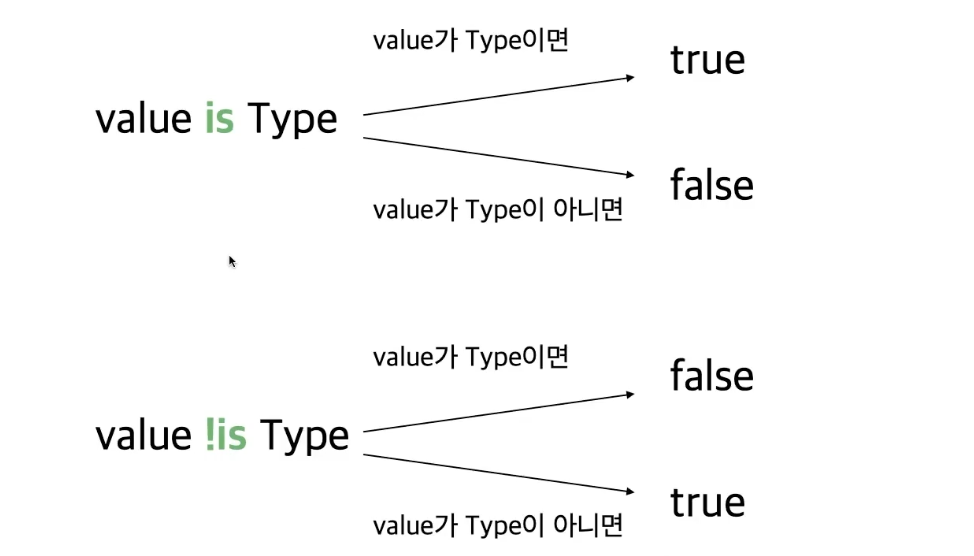
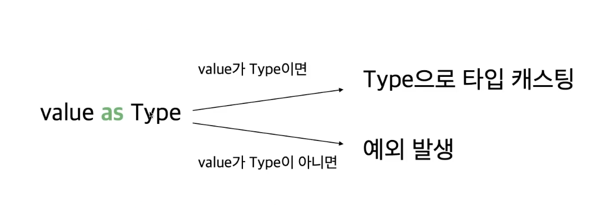
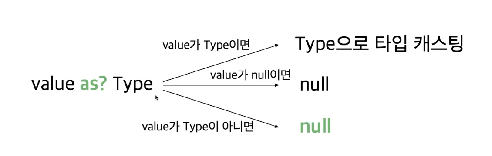

# 3. 코틀린에서 Type을 다루는 법

## 1. 기본타입

코틀린은 선언된 기본값을 보고 타입을 추론한다.

```kotlin
val number1 = 3; // int
val number2 = 3L; // double
```

코틀린은 암시적 타입 변경이 불가능하다. 그러므로 `toLong`, `toDouble` 등을 이용해 변경해야 한다.

```java
int number1 = 4;
long number2 = number1;

System.out.println(number1 + number2); // long으로 타입 변경
```

```kt
val number1 = 4;
val number2: Long = number1 // Type Mismatch

println(number1 + number2)

============>
// 타입 변환 메서드로 명시적으로 변환해야 된다.
val number1: Int = 4;
val number2: Long = number.toLong();

println(number1 + number2);
```

> nullable 변수에 대해서는 적절한 처리가 필요하다.

## 2. 타입 캐스팅

```java
public static void printAgeIfPerson(Object obj) {
    if(obj instanceOf Person) {
        Person p = (Person) obj;
        System.out.println(p.getAge());
    }
}
```

코틀린으로 변환해보자
> 코틀린에서는 `instanceOf`를 사용하지 않고 `is`를 사용한다.

```kotlin
fun printAgeIfPerson(obj: Any) {
    if(obj is Person) {
        val p = obj as Person; // obj를 person 타입으로 간주한다.
        println(p.age);
        println(obj.age); // start cast라고 부른다. 코틀린에서는 가능함.
    }
}
```

instanceOf의 반대도 존재할까?
> `obj !is Person`으로 사용할 수 있다.

```kotlin
fun printAgeIfPerson(obj: Any?) {
    val person: Person? = obj as? Person // 없으면 null로 변환
    println(person?.age);
}
```





## 3. kotlin 특이 타입 3개

아래 3가지가 존재함.

### 3.1. Any

- 자바의 Object 역할 (최상위 타입)
- 모든 Primitive Type의 최상위 타입도 Any다.
- Any 자체는 null을 포함할 수 없어 null을 포함하고 싶으면 Any?를 사용해야 됨.
- Any에 equals, hashCode, toString 존재

> TS에서도 any가 어떠한 값도 들어올 수 있다는 걸 의미함.

### 3.2. Unit

- 자바의 void와 동일함
- void와 달리 Unit은 그 자체로 타입 인자로 사용가능함.
- 함수형 프로그래밍에서 Unit은 단 하나의 인스턴스만 갖는 타입을 의미. 코틀린의 Unit은 실제 존재하는 타입이라는 걸 의미

### 3.3. Nothing

- 함수가 정상적으로 끝나지 않았다는 사실을 표현하는 역할
- 무조건 예외를 반환하는 함수 / 무한루프 함수 등

### 3.4. String Interpolation / String Indexing

JAVA에서는 StringBuilder나 String.format을 사용해야 됐지만 `${원하는 변수}`를 통해 String을 만들 수 있게 변경됨

> JS에서도 제공함.

```kotlin
val name: String = "이동준";
val sports: String = "테니스";
val introduce: String = "안녕하세요. ${name}입니다. 저는 $sports 을 좋아합니다.";
// 안녕하세요. 이동준입니다. 저는 테니스을 좋아합니다. -> 2가지 형태(중괄호 생략)도 가능
```

여러줄에 걸친 출력을 원할경우

```kotlin
    val name = "이동준";
    """
        ABCD
        EFG
        $name
    """.trimIndent()
========>
ABCD
EFG
이동준
```

문자열에서 특정 문자 가져오려면?

```java
String str = "ABCDE";
char ch = str.charAt(1);
```

```kotlin
val str = "ABCDE";
val ch = str[1];
```
