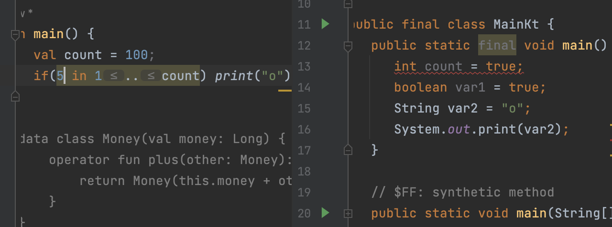
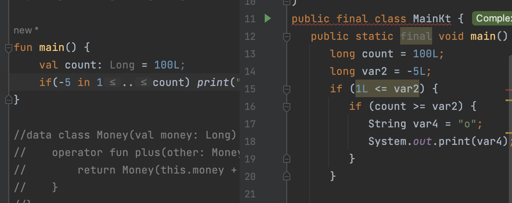

# 4. 코틀린에서 연산자를 다루는 방법

## 1. 단항 연산자

### 1.1 단항연산자

1. ++
2. --

### 1.2 산술연산자

1. +
2. -
3. %
4. *
5. /

### 1.3 산술대입연산자

1. +=
2. -=
3. %=
4. /=
5. *=

### 1.4 비교 연산자

1. >=
2. <=
3. <
4. >

동일하나 Java와 다르게 객체를 비교할 때, 비교 연산자를 사용하면 자동으로 compareTo를 호출해준다.

## 2. 비교 연산자와 동등성, 동일성

1. 동등성(Equality): 두 객체의 값이 같은가?
2. 동일성(Identity): 두 객체가 완전히 동일한가? -> 주소가 같은가?

> Java에서는 동등성을 확인하기 위해서 `equals`를 사용했고 동일성을 확인하기 위해서 `==`을 사용했다.

Kotlin에서는 동일성에 `===`을 동등성에 `==`을 사용하면 equals를 호출해준다.
> JS와 매우 유사한데? JS에서도 `===`는 값뿐만 아니라 동일한 주소를 쓰는 지 체크하고 `==`는 단순 값비교이기 때문이다.

### Example

```java
Person person1 = new Person("이동준", 28);
Person person2 = new Person("이동준", 29);
Person person3 = person1;

if(person1 == person3) System.out.println("person1, person3의 동일성이 같다");
if(person1.equals(person2)) System.out.println("person1, person2의 동등성이 같다.");
```

코틀린이라면?

```kotlin
val person1 = Person("이동준",28);
val person2 = Person("이동준",29);
val person3 = person1;

if(person1 === person3) println("person1, person3의 동일성이 같다.");
if(person1 == person2) println("person1, person2의 동등성이 같다.");
```

## 3. 논리 연산자와 코틀린에 있는 특이 연산자

1. &&
2. ||
3. !

Java와 동일하며 Lazy 연산을 수행한다.
> Lazy연산이란?
> 연산을 수행하면서 동작하되 상황에 의해 바로 본문으로 이동.

### 3.1 in / !in

컬렉션이나 범위에 포함되어 있는지 아닌지

### 3.2 a..b

a부터 b까지의 범위 객체를 생성

```kotlin
for (i in 1..4) print(i) // 1234

fun main() {
    val count = 100;
    if(5 in 1..count) print("o"); // 1~count까지의 범위가 생성됨.
}
```



재밌는건 truthy를 넣어서 decompile 해보면 true로 반환해서 넣어둔다.
> compiler가 진짜 똑똑한듯




### 3.3 a[i]

a에서 특정 index i로 값을 가져온다.

### 4. 연산자 오버로딩

kotlin에서는 객체마다 연산자를 직접 정의할 수 있다.
> C++에서 배웠던 것과 비슷해보이네요

```kotlin
data class Money(val money: Long) {
    operator fun plus(other: Money): Money {
        return Money(this.money + other.money);
    }
}

fun main() {
    val money1: Money = Money(1000L)
    val money2: Money = Money(2000L)

    println(money1 + money2) // Money(money=3000)
}
```

자바였다면 객체에서 plus 등 함수를 써야 됐지만 여기서는 연산자로 가능하다.
