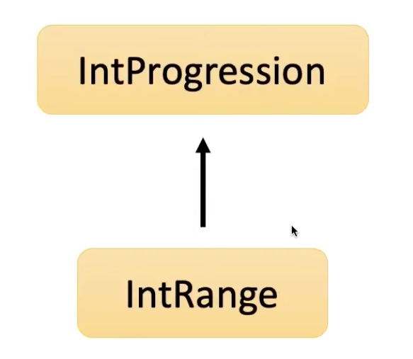

# 코틀린에서 반복문을 다루는 방법

## 1. for-each

숫자가 들어있는 리스트를 하나씩 출력하는 예제

```java
List<Long> numbers = Arrays.asList<>(1L,2L,3L);
for(Long number : numbers) {
    System.out.println(number);
}
```

```kotlin
val numbers = listOf(1L,2L,3L)
for(number in numbers) { // iterable이 구현된 타입이면 모두 들어갈 수 있다. `:` 대신 in이 들어간다.
    println(number)
}
```

## 2. for

```java
for(int i = 0; i <= 3; i++) {
    System.out.println(i);
}
```

```kotlin
for(i in 1..3) {
    println(i)
}
```

내려가는 경우는?

```
for(int i = 3; i > 0; i--) {
    System.out.println(i);
}
```

```kotlin
for(i in 3 downTo 1) {
    println(i)
}
```

2씩 올리고 싶으면?
```java
for(int i = 1; i<=5; i+=2) {
    System.out.println(i);
}
```

```kotlin
for(i in 1..5 step 2) {
    println(i)
}
```

## 3. progression, range

..연산자 => 범위를 만들어내는 연산자

(1..3) : 1부터 3의 범위



```md
1..3 => 1에서 시작하고 3으로 끝나는 등차수열을 만든다.
3 downTo 1 => 3부터 1까지 1칸씩 내려가는 등차수열
```


kotlin에서 전통적인 for문은 등차수열이다.

## 4. while
```kotlin
var i = 1
while(i <= 3) {
    println(i)
    i++
}
```

do-while도 java와 동일하다.
