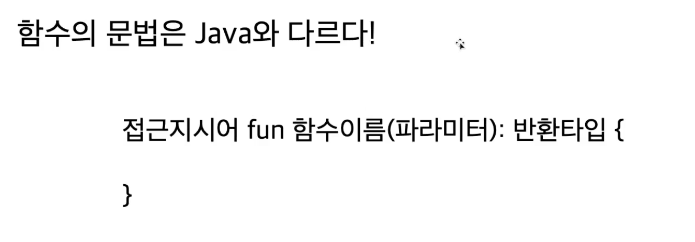

# 8. 코틀린에서 함수를 다루는 방법

## 1. 함수 선언 문법

```java
public int max(int a, int b) {
    if(a > b) {
        return a;
    } else {
        return b;
    }
}
```



```kotlin
fun max(a: Int, b: Int): Int {
    return if(a > b) {
        a
    } else {
        b
    }
}
=============>
fun max(a: Int, b: Int): Int =
    if(a > b) {
        a
    } else {
        b
    }
==============>
fun max(a: Int, b: Int) = if(a > b) { a } else { b } // 타입이 생략 가능한 이유는 =을 사용했기 때문
```

block{} 을 사용하는 경우에는 반환타입이 Unit이 아니라면 명시적으로 작성해주어야 함.

함수는 클래스 안에 있을 수도, 파일 최상단에 있을 수도 있다. 또한 한 파일안에 여러 함수들이 있을 수 있다.

## 2. default Parameter

주어진 문자열 N번 출력하기

```java
public void repeat(String str, int num, boolean useNewLine) {
    for(int i = 1; i <= num; i++) {
        if(useNewLine) {
            System.out.println(i);
        } else {
            System.out.print(i);
        }
    }
}
public void repeat(String str, int num) { // 오버로딩
    repeat(str, num, true);
}

public void repeat(String str) {
    repeat(str, 3, true);
}
// ==> 메소드 3개나 만들어지는데 ,,,,
```

코틀린에선?

```kotlin
fun repeat(
    str: String,
    num: Int = 3,
    useNewLine: Boolean = true
) {
    for(i in 1..num) {
        if(useNewLine) println(str)
        else print(str)
    }
}
```

코틀린에서도 오버로딩,오버로드는 있다.

## 3. named argument(parameter)

```kotlin
// 2번에서 다룬 repeat에서 line 수정을 안하고 싶을 때,
repeat("Hello world", useNewLine = false); // => useNewLine 처럼 쓰는 경우를 named argument 다.
```

빌더를 직접 만들지 않고 빌더의 장점을 가질 수 있다.

```kotlin
fun printNameAndGender(name: String, gender: String) {
    println(name)
    println(gender)
}

fun main() {
    printNameAndGender(gender = "FEMALE", name = "DANI"); // 동일한 타입이라 뒤집어서 적는 경우가 존재함.
}
```

*Kotlin에서 java 함수를 가져다 쓸 경우에는 named argument를 사용할 수 없다.*
> JVM에서 java가 byteCode로 변환될 때, 파라미터 이름을 보존하고 있지 않아 코틀린에서는 이름을 가져다 쓰는 named argument를 사용할 수 없다.

## 4. 같은 타입의 여러 파라미터 받기

목표: 문자열 N개 출력하기

```java
public static void printAll(String...strings) {
    for(String str: strings) {
        System.out.println(str);
    }
}
```

```kotlin
fun printAll(vararg strings: String) { // ... 대신 제일 앞에  vararg를 적자.
    for(str in strings) {
        println(str)
    }
}

fun main() {
    printAll("A", "B", "C")
    val array = arrayOf("A", "B", "C")
    printAll(*array) // spread연산자라해서 배열안에 있는 것들은 마치 `,`를 쓰는 것과 같다.
}
```

