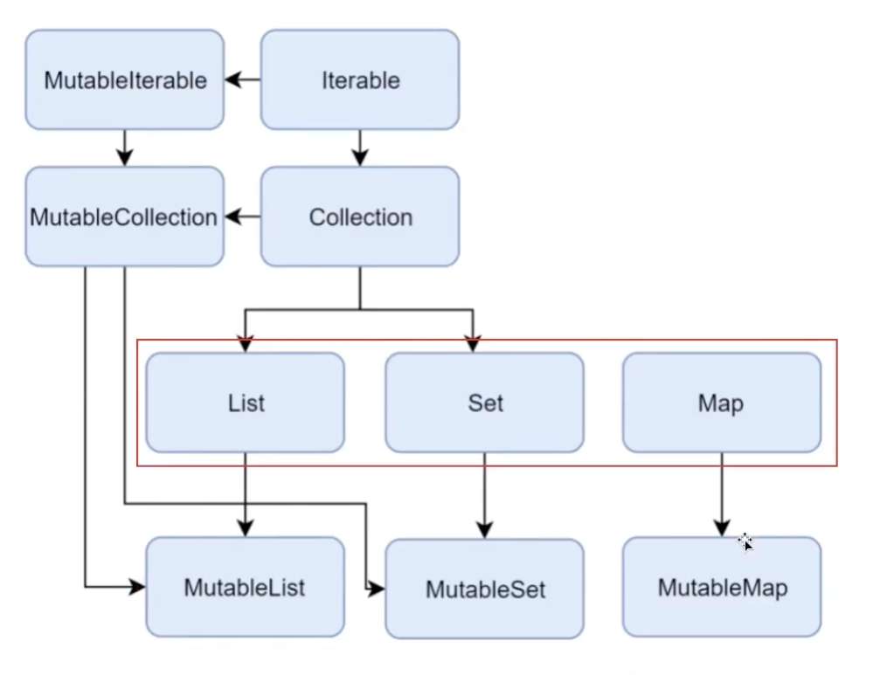

# 9. 코틀린에서 배열과 컬렉션을 다루는 방법

## 1. 배열

> 잘 사용하지 않음 -> 문법만

```kotlin
val array = arrayOf(100, 200);
for(i in array.indices) { // 인덱스 : 0부터 마지막 인덱스까지 가져올 수 있음.
    println("%{i} ${array[i]}")
}
====================>
for((idx, value) in array.withIndex()) { // 인덱스와 값을 함께 가져온다.
    println("$idx $value")
}
===================>
array.plus(300)
```

## 2. collections

불변인지 가변인지 선언이 꼭 필요하다.




불변이어도 reference안에 값을 바꿀 수 있는건 자바와 동일

Kotlin은 가변과 불변을 처음에 꼭 선언해주고 들어가야 한다.

### 2.1 List

```kotlin
fun main() {
    val numbers = listOf(100,200) // 자동 int로 추론됨 // listOf로 불변리스트 만들 수 있다.
    val emptyList = emptyList<Int>() // 명시적으로 리스트에 들어갈 타입 넣기

    printNumbers(emptyList()) // 아래 타입으로 List<Int>가 추론되어 타입을 안넣어도 됨.
}

private fun printNumbers(numbers: List<Int>) {
    ...
}
```

접근방법

```kotlin
fun main() {
    val numbers = listOf(100,200)
    println(numbers[0])
    
    for(number in numbers) {
        println(number)
    }

    for((idx, value) in numbers.withIndex()) {
        println("$idx $value")
    }
}
// ==================>
// 가변을 원할 경우 -> mutableListOf를 사용하면 된다. -> 기본구현체는 ArrayList다. java와 문법 동일
```

> 활용 팁: 불변 리스트로 만들고 가변리스트로 변환해가기

### 2.2 Set

```kotlin
val numbers = setOf(100, 200);
============>
val numbers = mutableSetOf(100, 200); // linkedHashSet을 사용함.
```

### 2.3 Map

```java
// JDK 8
Map<Integer,String> oldMap = new HashMap<>();
oldMap.put(1, "MON");
oldMap.put(2, "TUE");
// JDK 9
Map.of(1, "MON", 2, "TUE");
```

코틀린에선?

```kotlin
val oldMap = mutableMap<Int, String>();
oldMap[1] = "MON";
oldMap[2] = "TUE";

mapOf(1 to "MON", 2 to "TUE"); // -> to는 중위함수에 해당한다.
```

가변 Map이기 때문에 put도 가능하고 직접 접근해서 설정할 수 있다.

#### 2.3.1 활용방법

```kotlin
for(key in oldMap.keys) {
    println(key)
    println(oldMap[key])
    println(oldMap.get(key))
}

for((key, value) in oldMap.entries) {
    println(key + " " + value)
}
```

### 2.4 컬렉션의 null 가능성

1. `List<Int?>`
    - 리스트에 null이 들어가지만 리스트는 null이 아니다.
2. `List<Int>?`
    - 리스트에 무조건 Int지만 리스트가 null일 수 있다. 
3. `List<Int?>?`
    - 리스트도 null이 가능하고 리스트가 null일 수 있다.

> 자바는 읽기전용 컬렉션과 변경가능 컬렉션을 구분하지 않는다. 또한 Nullable 타입과 nonNullable 타입을 구분하지 않는다.
> Kotlin쪽의 컬렉션이 Java에 호출되면 컬렉션의 내용이 변할 수 있어 감안해야 됨.
> 코틀린쪽에서 `Collections.unmodifableXXX()` 쓰면 변경자체를 막을 수 있다.

Kotlin에서는 Java 컬렉션을 쓸때, 플랫폼 타입을 신경써야 한다. [2.3.1의 활용방법 처럼 뭔지 모른다.]
> Java코드를 보며 가져오는 지점을 wrapping해서 써야한다.

