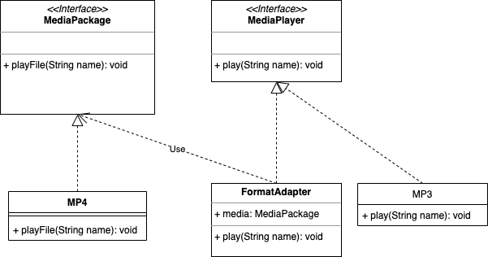

## Adapter 패턴

GoF 디자인패턴 중 구조패턴에 속하고 있는 Adapter 패턴이다.

### 용도

이미 주어진 라이브러리 or 패키지를 서비스에 이식할 때, 타입이 일치하지 않아 어려움을 겪을 때 사용하면 좋다.

라이브러리 코드에 수정도 없고 이미 작성된 코드에 수정도 없다. 오로지 인터페이스와 인터페이스의 구현체에서 라이브러리와 사용중인 코드를 연결지어 주기만 하면 된다.

### 예시

MP3 플레이어를 예시로 들어 MP4와 기타 확장자에 대해서는 Adapter를 구현해 내부 기능이 수정되지 않고 맞물려 동작할 수 있게 함.