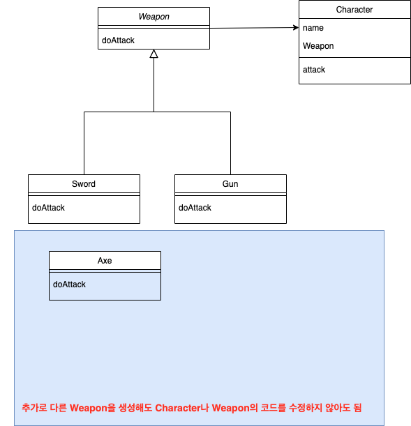

## 전략 패턴

### 
1. 인터페이스를 이용한 구현과 선언의 분리
2. Delegation을 통한 책임 위임
3. 클래스 추가 생성 및 제거가 용이함
    - ex)에 나오는 메인 클레스나 캐릭터를 수정하는 일이 없음.
4. 인터페이스를 통합한 composition을 통해 필요한 클래스에 적재적소 적용이 가능

### 단점

1. 일관성이 없다면 복잡해 보이기 쉬움(파일이 많이 생성될 가능성이 높다)

