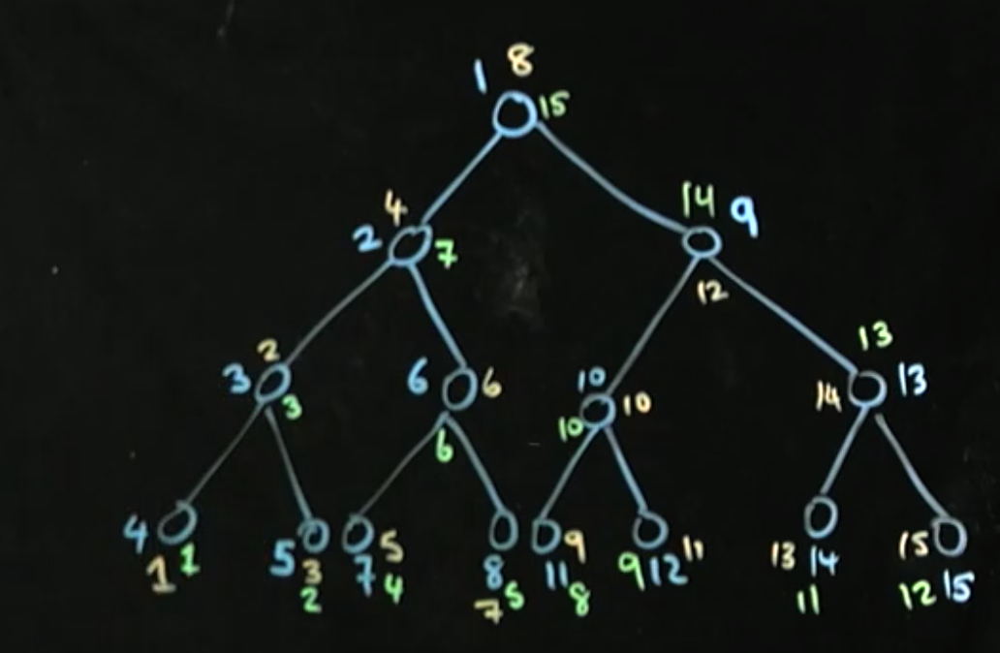
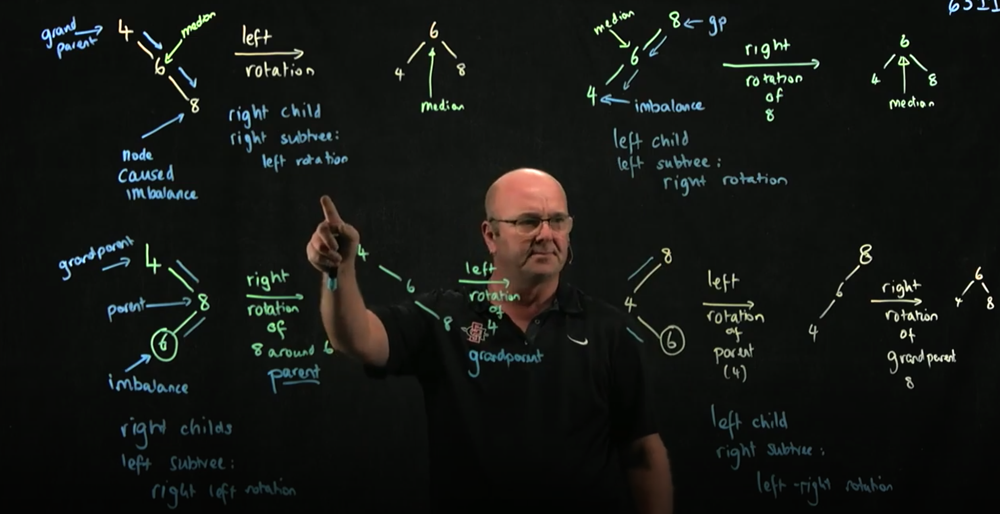

## Tree

### 노드 클래스

트리에서는 엄마 노드보다 작은 데이터가 왼쪽, 엄마 노드보다 큰 데이터가 오른쪽에 와야 합니다.
어떤 수를 찾고자 할 때, 엄마 노드보다 작으면 왼쪽, 크면 오른쪽을 선택해서 전체 데이터의 반은 무시하고 logn의 복잡도를 가지게 된다.

### 트리 종류

##### 완전트리

모든 잎이 아닌 노드가 2개의 자식 노드를 가지고 있고 마지막 줄은 왼쪽에서 오른쪽 순서로 채워져 있는 트리입니다.

##### 정트리

모든 잎이 아닌 노드가 2개의 자식 노드를 가지고 있고 모든 잎이 같은 레벨에 있는 트리입니다.

### 순회(탐색)

순회를 돌 때, 서브트리를 생각하면서 돌면 쉽다.


(파란색 : 전위, 노란색 : 중위, 초록색 : 후위)
#### 깊이 우선 탐색
재귀를 이용해 푸는 경우가 많음

    1. 전위 순회
        - rootNode - left - right (파랑)
        - 단점
            - 표현에 따라 연산자 우선순위를 적용하기 힘들어 계산하기 어렵다.

    2. 중위 순회
        - left - rootNode - right (노랑)
        - 특징
            - 괄호를 통해 수를 더해야해서 연산자 우선순위를 따지게 된다.

    3. 후위 순회
        - left - right - rootNode (초록)
        - 장점
            - 연산자 우선순위와 상관없이 계산이 가능하다.

#### 너비 우선 탐색
레벨순으로 트리 노드에 넘버를 붙인다.

### 회전
Balance가 맞지 않을 때, O(logn) or O(N)이 될 수 있다.


### 코드 


```java
public class Tree<E> {
    public class Node<E> {
        E data;
        Node<E> left, right;

        public Node(E obj) {
            this.data = obj;
            left = right = null;
        }
    }
    int currentSize;
    Node<E> root;
    
    public void add(E obj) {
        if(root == null) {
            root = new Node<E>(obj);
        } else {
            add(obj, root);
        }
        currentSize++;
    }
    /**
     * 새로운 데이터를 추가하는 과정
     * 1. 루트에서부터 시작한다.
     * 2. 트리의 규칙에 따라 내려간다( 왼쪽은 부모보다 작음, 오른쪽은 부모보다 큼)
     * 3. null인 부분을 찾으면 그곳에 새로운 노드를 추가
     */
    private void add(E obj, Node<E> node) {
        // 정책을 정할 때, 다른 함수에서도 유지해라.
        if(((Comparable<E>) obj).compareTo(node.data) > 0) {
            // go to right
            if(node.right == null) {
                node.right = new Node<E>(obj);
                return;
            } else {
                return add(obj, node.right);
            }
        } 

        if(node.left == null) {
            node.left = new Node<E>(obj);
            return;
        }
        return add(obj, node.left);
    }
    public boolean contains(E obj) {
        return contains(obj, root);
    }
    /**
     * 특정요소가 포함되어있는지 찾을 수 있는 과정
     * 루트에서부터 시작
     * 트리의 규칙에 따라 내려간다.
     * 그 요소를 찾으면 true, 아니면 false를 리턴
     */
    private boolean contains(E obj, Node<E> node) {
        if(node == null) {
            return false;
        }
        int compare = ((Comparable<E>) obj).compareTo(node.data);
        if(compare == 0) {
            return true;
        } else if(compare > 0) {
            return contains(obj, node.right);
        }

        return contains(obj, node.left);
    }
    public Node<E> remove(E obj) {
        return remove(obj, root);
    }
    /**
     * 특정요소를 제거하는 방범
     * 1. 리프 노드 => 그 노드의 부모 노드의 포인터를 null로 설정
     * 2. 자식 노드가 하나인 노드를 제거하는 경우 
        => 그 노드의 부모 노드의 포인터를 자식노드로 향하게 한다. 주의할 점은 부모 노드에서 사용했던 포인터와 같은 포인터를 사용해야 한다.
     * 3. 자식노드가 2개인 노드를 제거하는 경우 => 중위 후속자와 중위 선임자 중 하나와 자리를 바꾼 후 그 잎 단어를 제거합니다.
     * 
     * 중위 후속자 : 제거하고자 하는 노드에서 시작해 왼쪽으로 한 번 내려갔다가 오른쪽으로 내려간 곳의 잎 노드입니다.
     * 중위 후속자는 제거하고자 하는 노드보다 작은 노드들 중에서 가장 큰 노드입니다.
     * 중위 선임자 : 제거하고자 하는 노드에서 시작해 오른쪽으로 한 번 내려갔다가 계속 왼쪽으로 내려간 곳의 잎 노드입니다. 
     * 중위 선임자는 제거하고자 하는 노드보다 큰 노드들 중에서 가장 작은 노드입니다.
     */
    private Node<E> remove(E obj, Node<E> node) {
        if(node == null) {
            return node;
        }
        if(((Comparable<E>)obj).compareTo(node.data) < 0) {
            node.left = remove(obj, node.left);
        } else if(((Comparable<E>)obj).compareTo(node.data) > 0) {
            node.right = remove(obj, node.right);
        } else {
            if(node.left == null) {
                return node.right;
            } else if(node.right == null) {
                return node.left;
            }

            Node temp = minValueNode(node.right);
            node.data = temp.data;
            node.right = remove(temp.data, node.right);
        }
        return node;
    }
    public Node<E> minValueNode(Node<E> node) {
        Node<E> currentNode = node;
        while(currentNode.left != null) {
            currentNode = currentNode.left;
        }
        return currentNode;
    }
    public Node<E> leftRotate(Node<E> node) {
        Node<E> tmp = node.right;
        node.right = tmp.left;
        tmp.left = node;
        return tmp;
    }
    public Node<E> rightRotate(Node<E> node) {
        Node<E> tmp = node.left;
        node.left = tmp.right;
        tmp.right = node;
        return tmp;
    }
    public Node<E> rightLeftRotate(Node<E> node) {
        node.right = rightRotate(node.right);
        return leftRotate(node);
    }
    public Node<E> leftRightRotate(Node<E> node) {
        node.left = leftRotate(node.left);
        return rightRotate(node);
    }
}

```