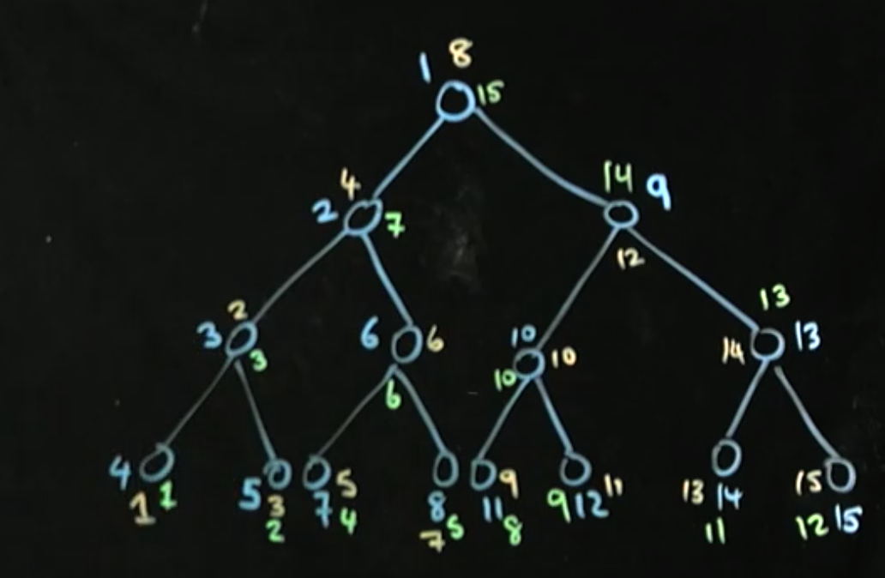

### Tree

##### 완전트리

모든 잎이 아닌 노드가 2개의 자식 노드를 가지고 있고 마지막 줄은 왼쪽에서 오른쪽 순서로 채워져 있는 트리입니다.

##### 정트리

모든 잎이 아닌 노드가 2개의 자식 노드를 가지고 있고 모든 잎이 같은 레벨에 있는 트리입니다.

#### 순회

순회를 돌 때, 서브트리를 생각하면서 돌면 쉽다.



#### 깊이 우선 탐색
재귀를 이용해 푸는 경우가 많음

##### 전위 순회
- rootNode - left - right (파랑)
표현에 따라 연산자 우선순위를 적용하기 힘들어 계산하기 어렵다.

##### 중위 순회
- left - rootNode - right (노랑)

##### 후위 순회
- left - right - rootNode (초록)
연산자 우선순위와 상관없이 계산이 가능하다.


#### 너비 우선 탐색
레벨순으로 트리 노드에 넘버를 붙인다.

### 회전
Balance가 맞지 않을 때, O(logn) or O(N)이 될 수 있다.


```java
public class Tree<E> {
    public class Node<E> {
        E data;
        Node<E> left, right;

        public Node(E obj) {
            this.data = obj;
            left = right = null;
        }
    }
    int currentSize;
    Node<E> root;
    
    public void add(E obj) {
        if(root == null) {
            root = new Node<E>(obj);
        } else {
            add(obj, root);
        }
        currentSize++;
    }
    private void add(E obj, Node<E> node) {
        // 정책을 정할 때, 다른 함수에서도 유지해라.
        if(((Comparable<E>) obj).compareTo(node.data) > 0) {
            // go to right
            if(node.right == null) {
                node.right = new Node<E>(obj);
                return;
            } else {
                return add(obj, node.right);
            }
        } 

        if(node.left == null) {
            node.left = new Node<E>(obj);
            return;
        }
        return add(obj, node.left);
    }
    public boolean contains(E obj) {
        return contains(obj, root);
    }
    private boolean contains(E obj, Node<E> node) {
        if(node == null) {
            return false;
        }
        int compare = ((Comparable<E>) obj).compareTo(node.data);
        if(compare == 0) {
            return true;
        } else if(compare > 0) {
            return contains(obj, node.right);
        }

        return contains(obj, node.left);
    }
    public Node<E> remove(E obj) {
        return remove(obj, root);
    }
    private Node<E> remove(E obj, Node<E> node) {
        if(node == null) {
            return node;
        }
        if(((Comparable<E>)obj).compareTo(node.data) < 0) {
            node.left = remove(obj, node.left);
        } else if(((Comparable<E>)obj).compareTo(node.data) > 0) {
            node.right = remove(obj, node.right);
        } else {
            if(node.left == null) {
                return node.right;
            } else if(node.right == null) {
                return node.left;
            }

            Node temp = minValueNode(node.right);
            node.data = temp.data;
            node.right = remove(temp.data, node.right);
        }
        return node;
    }
    public Node<E> minValueNode(Node<E> node) {
        Node<E> currentNode = node;
        while(currentNode.left != null) {
            currentNode = currentNode.left;
        }
        return currentNode;
    }
}

```